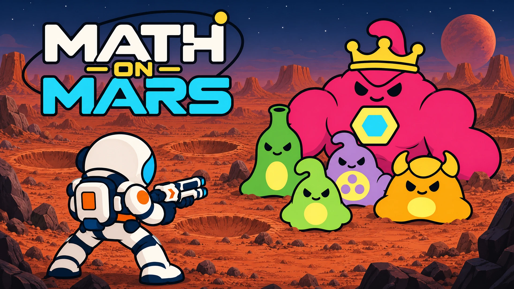

# Math on Mars



A browser game that mixes space battles with math practice for Kindergarten through Grade 5.

Explore your base camp, enter the portal, and fight waves of alien slimes. Between waves, answer math questions to earn upgrades. Collect salvage and chests, improve your gear, and get ready for the next fight.

Each trip through the portal starts a fresh mission. You can pause a mission, but leaving or closing the game loses that mission’s progress. Player settings and math practice history are saved.

## Run locally

Install Node.js and pnpm, then run:

```sh
pnpm install
pnpm dev
```

Open the local address shown in the terminal.

## Development

Built with TypeScript, Phaser, and Vite.

- `pnpm test` runs the tests.
- `pnpm build` creates the production build.
- `src/assets/` contains the game’s artwork, audio, and fonts.
- [CONTEXT.md](CONTEXT.md) explains the game rules and design decisions.
