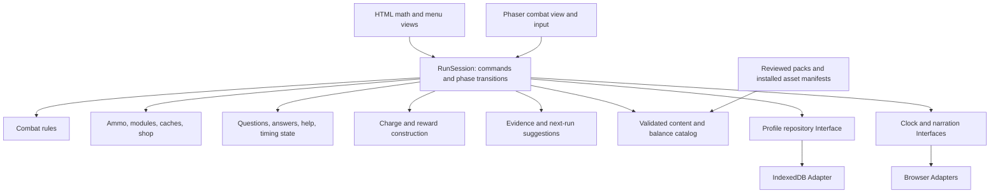
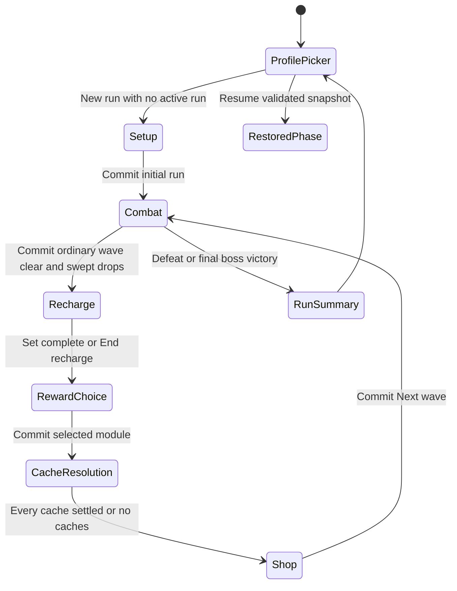
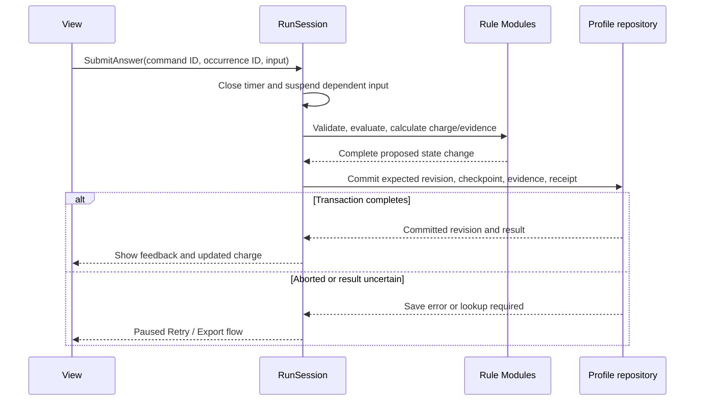

# Math on Mars — Architecture

Status: proposed implementation architecture, September 12, 2026. This document describes the planned system; the workspace currently contains planning documents and reference images, not an implemented game.

Updated September 13, 2026: phone and tablet support joins desktop as a launch requirement. Planning documents live in `docs/`; the repository layout in section 12 distinguishes these existing files from planned implementation directories.

The product source of truth is [GAME_PLAN.md](/Users/tig/Desktop/tigran/mathonmars/docs/GAME_PLAN.md), referred to below as the PRD. Read it for gameplay rules, balance values, educational review, launch gates, and confirmed versus provisional decisions. Use [WIZARDGENIE_PROMPTS.md](/Users/tig/Desktop/tigran/mathonmars/docs/WIZARDGENIE_PROMPTS.md) for generation and integration briefs, and [QUIZCASTER_REFERENCES.md](/Users/tig/Desktop/tigran/mathonmars/docs/QUIZCASTER_REFERENCES.md) when implementing the educational screens. This architecture does not promote provisional product defaults to confirmed requirements.

Design-review calculations and test cases are in [DESIGN_VALIDATION.md](/Users/tig/Desktop/tigran/mathonmars/docs/DESIGN_VALIDATION.md), reproduced by [design_checks.py](/Users/tig/Desktop/tigran/mathonmars/docs/design_checks.py). The PRD controls the revised wrong-answer drop, full-range strength, dual evidence windows, timing exposure, acquisition and compact combat rules. The accuracy streak and K–1 Short recommendation remain explicit proposals pending owner choice.

**1. System shape and technical decisions**

Build one responsive browser application for desktop, phones, and tablets with a Phaser combat view, HTML controls for math and menus, deterministic game rules, reviewed local content packs, and transactional local profiles. Support portrait and landscape touch play at launch. Deploy a static application; gameplay, answer evaluation, narration, and saving have no runtime backend or AI dependency.

| Area | Proposed implementation | Reason and boundary |
|---|---|---|
| Language | TypeScript with strict checking | Make phase, answer, inventory, and save contracts explicit; validate external data at runtime as well |
| Build | Vite, if compatible with the actual WizardGenie project | A small browser build; use the harness's existing build/preview configuration when required |
| Combat presentation | Phaser, version verified and pinned during the first integration | Continue the PRD's Phaser approach without assuming the older game's version applies |
| Math and menus | Semantic HTML/CSS with TypeScript controllers | Native focus, editable numeric fields, large buttons, and readable equations; no UI framework required initially |
| Mobile input/layout | Pointer Events, a virtual movement stick, responsive DOM layouts, safe-area-aware viewport mapping | Touch, mouse, and keyboard reach the same commands; mobile layout does not change simulation or scoring rules |
| Combat rules | A fixed-step simulation using plain data | Restore enemies, projectiles, effects, and cooldowns without serializing engine objects |
| Local persistence | IndexedDB through one repository Interface | Commit learning, run changes, and settlement receipts together |
| Offline delivery | Versioned static assets and a service worker on the published origin | Support downloaded content and bundled K–1 speech without live generation |
| Verification | Pure rule tests, repository fault tests, and browser flow tests | Exercise correctness, durability, and actual input/audio behavior independently |

Phaser supports scene lifecycle management; use scenes for loading and combat presentation, while the application owns the gameplay phase. This avoids treating an engine scene transition as a saved game transaction. [Phaser scene documentation](https://docs.phaser.io/phaser/concepts/scenes).

Vite supports a vanilla TypeScript starting point. Its use here is an architectural recommendation, subject to the actual harness runtime, rather than a claim about an existing project setup. Record resolved engine, toolchain, and runtime versions in the package lockfile and runtime notes when scaffolding. [Vite guide](https://vite.dev/guide/).

Start on the main thread. Keep the simulation small: circle/segment collision tests, a spatial lookup, explicit enemy state machines, and bounded effect processing. Do not introduce an entity framework, general scripting engine, worker messaging, cloud accounts, or server infrastructure for this scope. Performance measurements can justify a later change.

**2. Ownership and dependency boundaries**



`RunSession` is the only coordinator allowed to publish authoritative session changes. Domain Modules own their rules; views send commands and render projections. A Module exposes a small Interface and hides its internal representation. An Adapter connects an Interface to a browser capability. Clock, narration, and persistence are explicit Seams because both browser execution and controlled failure/timing tests need them.

| Module | Owns | Public Interface responsibilities |
|---|---|---|
| Application / RunSession | Active profile, command ordering, phase transitions, persistence coordination | Start/resume/end a run; dispatch commands; advance combat; publish a read-only view; save and switch profiles |
| Combat | Movement, enemy decisions, spawning, targeting, collisions, HP, shots, status effects | Advance a fixed step; snapshot/restore combat; report pickups and terminal outcomes |
| Progression | Cartridge ownership, active order, merges/forge, stat-module instances, salvage, caches, shop | Validate and preview transactions; return an exact resulting inventory/loadout/stat change |
| Practice | Reviewed question selection, numeric parsing, attempts, help, question state | Create a fixed question set; evaluate a submission; transition through hint/retry/explanation |
| Rewards | Charge calculation, module quality, reward-instance magnitudes | Settle a question; construct and preserve three choices; resolve a selected offer |
| Learning | Profile-scoped evidence and suggestion state | Record distinct evidence; derive reports; propose a next step at run end or abandonment |
| Catalog | Immutable, versioned definitions and readiness | Resolve a definition by pinned ID/version; validate pack, balance, asset, and audio references |
| Persistence | Storage schema, revisions, atomic commits, backups, migration, import/export | Load a valid profile; commit an expected revision; recover or explain an unsupported save |
| Presentation / media | DOM, sprites, animation, sound, focus, pointer/touch/keyboard routing, viewport and safe-area layout | Render application projections; translate input into the same commands; report narration readiness/completion/errors |

The rule Modules must not import Phaser, the DOM, IndexedDB, generation tools, or wall-clock APIs. Views must not calculate correctness, spend salvage, roll offers, increment capacity, or award learning credit. The repository validates storage envelopes and revisions; domain Modules validate game invariants. Avoid a global event bus that lets arbitrary listeners mutate the run.

Inject the catalog, repository, active-time clock, narration control, and seeded random streams at session creation. Tests use a controlled clock, deterministic content, and a repository Adapter that can fail before or after commit. Production uses the browser Adapters. Keep these Interfaces specific to this game.

**3. Authoritative data model**

Use serializable records with stable IDs. Engine objects, DOM nodes, audio objects, timer handles, and function closures never enter saves. Grouped inventory stacks are a view over individually identified cartridges; equipped references point to those same owned instances.

| Record | Required contents |
|---|---|
| Profile | Stable ID, nickname/avatar, selected grade/skill, settings including touch handedness and quality preference, storage revision, active-run ID or null, learning/suggestion state, completed-run summaries |
| Run | ID, profile ID, interaction revision, phase/wave, mission preset, combat difficulty and capacity-ruleset ID/transition log, fixed skill/step and set size, content/balance/reward versions and chosen policy record, RNG/shuffle bags, repeat history references, inventory/modules, salvage, pending intermission, proposed accuracy-streak state |
| Ammo inventory | Cartridge records keyed by ID; normal type and T1–T4 or legendary; ordered active IDs; capacity-purchase count; legendary-forged flag |
| Combat snapshot | Tick/remainder and any interrupted substep cursor, arena/HP/entities, positions/velocities, behavior/telegraphs, queued spawns/volley admissions/hit work, cooldowns, med-kit, drops, shots, projectile falloff/ledgers, slow durations and funded-burn state |
| Question instance | Occurrence ID, exact content key and operand/task signature, template/bank ID, skill/step, content version, operands/diagram data, canonical answer, accepted form policy, hint/explanation/audio references, pinned pacing profiles |
| Question attempt | Draft, presentation/spacing eligibility, narration substate, submission IDs/answers, prior-help flags, wrong-submission count, actual edit-method history, exposure duration, pacing-profile versions, outcome and exact charge settlement |
| Intermission | Stable ID, planned set size, ordered instances, substate, raw and normalized charge, wrong-submission count, candidate/final tier and reasons, streak qualification, three fixed variant offers and chosen ID |
| Shop | Fixed offers/IDs, prices, purchased-slot flags, locks, refill generation, paid reroll count |
| Cache | Tagged choice cache (fixed option bundles, one selected option/disposition, closed receipt) or grant cache (fixed granted items and individual accept/sell receipts); fixed sale quotes |
| Learning event | Profile/run/occurrence IDs, skill/step and compatible version, presented/settled/spacing flags, first-submission eligibility/outcome, support-needed flag/reason, exposure/method, evidence and support watermarks |
| Commit receipt | Command ID and payload identity, affected run/phase/offer IDs, resulting storage/interaction revisions, result summary; unique within a profile |

Store normal ammo tier, stat-module quality, and ammo capacity as different types. A single `rarity` field must not control all three systems. Store the selected module's actual modifier magnitudes and source (`math`, `shop`, or `cache`); derive aggregate stats from those instances. Do not repeatedly multiply already modified stats on load.

Core invariants enforced on commands and save validation:

- Exactly one weapon slot. Active ammo capacity equals one plus the purchase count, with zero to three purchases. Active references are owned, unique, and no longer than capacity; normal active ammo types are unique.
- Reserve ownership is independent of active capacity. Legendary consumes one active slot and may overlap normal types, but effect resolution selects the strongest version once.
- HP is fractional Suit Integrity; armor is a bounded mitigation stat. There is no additional shield pool. Increasing maximum HP preserves missing HP.
- One active run belongs to one profile. Grade and selected skill step remain fixed within that run; combat difficulty is separate.
- Each question has at most two scored submissions and one charge settlement. Every wrong scored submission is counted once under the pending retry-detail default; candidate-to-final tier drop has a green floor. Each reward, choice cache, granted cache item, purchase, merge, and forge settles once. Unseen skipped items affect the set denominator, not the support-evidence window or presentation history.
- Defeat, victory, and abandonment leave no resumable active run. Learning evidence and completed-run summaries survive cleanup.

IDs are allocated once and saved, not recreated during view construction. Use separate identifiers for question content and its occurrence in a run: practicing the same template later is a new occurrence; resuming the current occurrence is not.

**4. Phase machine and command contract**



`RestoredPhase` means the phase stored in the snapshot, not a new gameplay phase. Save & Exit can leave any active phase after a successful save. Abandonment can end any active phase after explicit selection. Pause, loading, saving, and error overlays suspend the underlying phase; they do not manufacture another intermission or lose the current question.

Recharge has explicit substates: `preparing`, `initialNarration`, `answering`, `feedback`, `retry`, `explanation`, and `settled`. Reward choice, cache resolution, and shopping are untimed. An ordinary wave clears after its scheduled/queued spawns and all enemies, including splitter children, are exhausted. Its spawn timer alone cannot clear it. Then clear hostile projectiles, sweep outstanding ammo into reserve, fix the next question set, and commit before showing recharge. The final boss bypasses recharge; the internal three-wave slice instead ends on its last ordinary clear. Specify simultaneous marine/boss death ordering in balance/rule configuration before combat acceptance; the proposed default is defeat if marine HP reaches zero in that simulation step.

Commands include an ID, profile/run identity, expected phase and target identity, and an expected interaction revision. Examples are `SubmitAnswer`, `RequestHint`, `RevealAnswer`, `EndRecharge`, `ChooseReward`, `ChooseCacheOption`, `ResolveGrantedCacheItem`, `BuyOffer`, `RerollShop`, `MergeAmmo`, `ForgeOmni`, `SetActiveAmmo`, `StartNextWave`, and `AbandonRun`.

Keep three counters distinct: simulation tick orders combat; interaction revision invalidates stale action previews after a committed domain command; storage revision increments on every successful database write, including periodic checkpoints. Draft edits, timer updates and periodic-save completion do not invalidate an otherwise-current answer/card action. RunSession owns the interaction revision; only the persistence queue supplies the latest storage revision to repository compare-and-swap. Check an existing command receipt and matching payload before fresh-command phase/revision guards, so a retried successful purchase still returns its original result after the offer or phase has changed.

The command handler returns a committed result or a typed failure such as `wrongPhase`, `staleOffer`, `invalidIngredients`, `capacityReached`, `insufficientSalvage`, `contentUnavailable`, `saveFailed`, or `profileInUse`. It never partly spends currency and then reports failure. A repeated command ID with the same payload returns its stored result; reuse with different payload is rejected. UI-supplied charge, correctness, capacity, or resulting stats are never accepted as authoritative.

On every screen transition, release previous input bindings and require held pointers/keys to return to neutral before accepting the next action. A final Enter press or answer tap cannot also choose the first reward. Preserve focus deliberately, clear combat input on blur or touch cancellation, and pause combat whenever the math/menu phase owns input. Pointer IDs and a held virtual stick are transient: restoring a run always starts with neutral controls.

**5. Combat simulation and effect composition**

Use a proposed 60 Hz simulation step, independent of rendering. The simulation owns positions, collision dimensions, spawn timers, and effect timers. Phaser interpolates and animates its output; Arcade Physics is not a second authority moving the same entities. This choice makes exact snapshot restoration practical for the small enemy roster. Reassess it during the three-wave proof if the harness imposes a different physics integration.

Use stable entity-ID ordering for simultaneous collisions and target ties. Projectiles need swept segment tests so fast rounds do not skip small slimes between steps. Keep a spatial lookup for nearby enemies and rebuild its derived indexes on restore. The lookup, sprite pools, shadows, particles, and camera shake are not persistent game state.

A step processes an explicitly fixed order: spawn/behavior updates; movement and weapon cooldown/fire; ordered direct impacts and their allowed chain effects; status damage; deaths/splits/drops; pickups; terminal wave checks. Define any later ordering change as a simulation-rule version change. Frame stalls use a bounded catch-up budget; hidden time is discarded. Use the pinned standard/compact capacity rules below before overload becomes sustained. A repeatedly overloaded compact session fails the minimum-device acceptance check; do not loop endlessly between pause and Resume.

The one weapon builds an immutable shot payload from current stats and equipped ammo:

1. Resolve normal and legendary effects into one strongest value per effect type.
2. Snapshot D, volley count/total damage budget, per-impact piercing falloff, chain limits/damage, Frost, Fiery funding budget, and the explicit Omni capacity-rate bonus in the firing interval.
3. Allocate one `shotId` shared by every projectile in the volley, with a shared chain ledger.
4. Direct projectiles keep their own hit-target IDs and remaining piercing count. The first direct impact starts the shot's only chain; initialize its visited set with that impact target so the chain cannot jump back to its origin.
5. Each chain jump selects a new target within range of the preceding target and consumes the shared budget. Chain hits can apply Frost/Fiery but cannot launch another chain, pierce, or create projectiles.
6. Burns use a per-target remaining-damage reservoir R and rate v, with R/v ≤ three seconds, and remaining per-shot funds B initialized to f×D. Before a hit, account for damage already burned through that timestamp. For hit damage H, compute `nextRate = max(v, f×H / 3)` and `added = min(B, max(0, 3×nextRate − R))`. If added is zero, leave the burn unchanged. Otherwise debit added from B, set remaining damage to R+added, and set rate to nextRate; the resulting duration is `(R+added)/nextRate`, at most three seconds. A partially funded stronger hit can shorten duration while raising the rate, but cannot create unpaid damage. For a new burn use R=v=0. Each tick deals `min(R, v×activeDelta)` and debits the same amount; remove exhausted burns. Preserve simulation remainder on save. Across hits/ticks, total damage dealt plus outstanding damage cannot increase by more than the shot's debited funds. Burn ticks emit no hit effects. Frost independently retains its strongest slow and uses half strength against bosses.

Keep the chain and burn-funding ledgers until all projectiles and pending hit work belonging to that shot are gone. Save projectile hit histories/falloff indexes, chain budget/visited IDs, unspent burn funds, per-target remaining burn damage/rate, durations, and tick progress. Pooling a visual projectile must not reuse its gameplay ID while it remains referenced. Balance values come from the PRD's ammo table, not duplicated constants in rendering code.

At purple, a volley still has at most 25 direct plus four chain hit events, but the revised damage envelope is 3.1D direct + 0.8D chain + ≤0.9D funded burn = ≤4.8D lifetime crowd damage. Multi Shot's first-impact volley is 1.6D total, not five times 0.6D; pierce impacts decay by 0.5 each. The explicit Omni stabilizer can multiply firing rate by up to 1.12, giving a conservative sustained funding envelope of 5.376D×r for constantly fresh crowds, before passive changes already represented in D and r. This is not measured DPS or isolated-boss DPS. Track hit fraction, target count, overkill and burn non-stacking in the combat harness before milestone 7. An ammo pickup affects future shots only.

**Capacity-ruleset contract.** Read caps from the PRD's versioned standard/compact ruleset (initial live-enemy caps 80/40, live-damaging-projectile caps 160/80, pending-hit caps 256/128). Count pending splitter children and boss summons as queued spawn budget rather than bypassing the limit. At capacity, queue spawns; admit a complete volley only when projectile capacity permits, then debit its firing cooldown. Never emit half a volley. Drain admitted hit work in stable order before advancing the next simulation tick; a pending-hit limit controls admission, not damage deletion. Save queues and admission/cooldown state. Compact changes temporal density, so its balance reports and timings are separate. A checkpointed ruleset transition may grandfather existing objects until below the new caps; it records old/new IDs and never deletes them. A render-quality change alone cannot edit these rules.

Queue length is not a bound on total work in a tick. Generate collisions incrementally with a saved stable cursor and drain the admitted queue without dropping work; if the per-render work budget expires, continue that same substep on the next frame before advancing simulation time. Gate this on measured input/tick latency, not just entity counts. Give every projectile a finite lifetime/range, allow at most one pending volley per emitter, and use stable fair admission between player/enemy emitters so deferred cooldowns do not accumulate a burst. Validate that every authored volley fits the smallest supported projectile cap and every spawn budget is finite. Test a full queue, blocked boss volley, splitter saturation, ruleset switch and eventual wave clear; failure to drain or persistent backlog blocks the capacity ruleset.

Use independent saved random streams for combat/spawning, loot, shop, practice, and math-reward offers. Cosmetic particles use a separate stream. Preserve fixed outcomes as records as well as stream state: re-entering a screen must not reroll a cache or reward. The guarantee is continuation from a snapshot under compatible rules; do not promise identical simulations across engine/rule versions without verification.

**6. Ammo, equipment, and economy transactions**

Progression exposes preview and apply operations using the same validation path. “Atomic” means an indivisible domain change; only the explicitly durable boundaries below imply an IndexedDB commit. Combat pickups may roll back with the last combat checkpoint, together with their corresponding loose-drop state. A preview identifies consumed instances, exact output, active-slot changes, salvage cost, and any redundant effects. Confirmation revalidates against the current revision; a stale preview cannot consume replacement ingredients silently.

| Operation | Result and persistence boundary |
|---|---|
| Combat pickup | Add the fixed instance and auto-equip a new type only with a free slot, as one in-memory step. Persist in the next periodic checkpoint or wave-clear transaction; no per-pickup IDB write/freeze |
| Normal merge | Consume two selected matching type/tier instances below purple; create one next-tier instance; replace an equipped ingredient in its existing slot when applicable |
| Legendary forge | Consume exactly one selected purple of each of the five types; create Omni; reconcile active references/order; set the once-per-run flag and receipt |
| Equip/reorder | Update ordered references to owned instances within capacity; preserve all reserve ownership |
| Sell ammo | Require unequipped, sellable ammo; remove the selected instance and add salvage together |
| Buy Ammo Expander | Validate capacity and offer; spend salvage; increment purchases once; invalidate and replace capped expander offers once |
| Buy/accept stat module | Save actual modifiers and derived stat change in the owning shop/cache settlement |
| Choose cache option | Choose one option and accept or sell its complete fixed bundle; atomically create the two ammo instances/module or credit its sale quote, close all alternatives and save the cache receipt |
| Resolve granted cache item | Accept or sell one already-granted item exactly once; this operation rejects choice caches |
| Reroll/refill | Replace eligible offers, save new fixed offers and stream state, and update currency/counters together |

Forge checks owned inventory, including equipped copies, so it works at capacity one. Auto-equip legendary and preserve all unconsumed cartridges. If no consumed ingredient frees space in a full loadout, replace the lowest-priority active slot shown in the preview; its former cartridge remains owned. Legendary cannot be sold, split, forged twice, randomly acquired, or fed into another merge. Other equipped ammo adds no duplicate effect power. While Omni is equipped, derive the proposed +4% fire-rate stabilizer per purchased capacity slot, maximum +12%, once; redundant equipped references neither improve nor disable it. Save the purchased count and rule version, not a repeatedly compounded multiplier.

Ammo Expander is a shop-only discrete utility effect; it is outside stat quality and math-strength calculations. At capacity four, remove invalid expander offers including locked ones, replace each affected slot once without charge, and keep the paid reroll count. Distinguish purchased-slot tracking from slot replacement: invalidating an offer is not a purchase toward the four-purchase free refill. The fourth purchase triggers one free four-slot refill in the same transaction, retaining the paid reroll count.

Keep wave drop weights, prices, resale values, cache tables, shop eligibility, and stat caps in versioned balance data. Guarantee the first clear's eight salvage and the reserved 8-salvage Expander offer until purchased; this reserved offer supersedes rerolls and counts as an ordinary purchased slot. Purchased slots stay empty until all four slots in that refill generation have been bought; rerolls never reset those flags. Supply milestones create a choice cache with six mutually exclusive options: five fixed blue pairs and one green base-magnitude module. Save its selected option/disposition and close the entire cache atomically. A capped fixed cache module retains its quoted sell action instead of rerolling. Ten blue cartridges from five distinct choices suffice for the recipe, but the first cache also allows wave-one purple; compare that progression with staged tiers before approving this proposed economy. Optional ammo uses a persisted five-type shuffle bag. Batch normal merge remains one previewed, durable command.

Author 18 module variants within six families, each with actual ordered modifiers. A math offer requires first-stat headroom ≥1.50×base, positive actual gain in each additional promised modifier, three distinct variants and at least two first-stat priorities; prefer an unseen variant. RewardChoice permits no other stat-changing transaction and preserves its offers. Shop purchases deterministically replace/save newly invalid shop offers without counting replacements as purchases; fixed caches retain their sell route. Validate reachable shop/cache/high-quality reward states as well as nine floor-reward traces. If three legal math offers cannot be made, revise the catalog/caps/economy before acceptance; no silent zero-value fallback. Preserve the free math module pool separately from ammo/Expander/legendary. Use provisional full-mission balance fixtures in milestone 5 so acquisition and DPS can be tested before milestone 7's finished enemies/art.

**7. Reviewed math content and answer evaluation**

Separate authored definitions, compiled reviewed packs, and runtime instances. A pack includes its subject, grade, skill IDs/steps, standard references, version, evidence compatibility key, reviewer status, templates or finite item bank, input policy, pacing targets, hints/explanations, and required media manifest. Pack approval metadata records the review; a generated file alone does not count as approval.

K–1 runtime selection uses only the finite reviewed bank with complete bundled narration. Grades 2–6 use reviewed deterministic templates with bounded operands and computed answers. A new content version cannot silently reuse an old approval for changed questions, explanations, or pacing. All seven reviewed grade tracks are required for public release; a grade-3 prototype or sample K–1 pack remains internal.

At intermission creation, pin N and save all instances: 3+2 selected/review for N=5, 2+1 for N=3, or all selected with no history. Persist per-profile recent exact IDs and operand/task signatures; enforce the PRD's minimum banks and spacing rules before consuming selection RNG. Save each occurrence's operands, diagram, answer policy, pacing-profile IDs, content IDs and spacing eligibility. A permitted spacing relaxation is marked repeat practice and cannot advance promotion evidence or the proposed accuracy streak. Unseen trailing items settled by End recharge remain outside the support window. A failed required narration makes the item unavailable: replace an unattempted item only through a saved, deterministic selection from ready reviewed items; if no suitable item is ready, pause with an adult-facing diagnostic. Preserve any already submitted outcomes and never silently substitute an active attempted question.

Selection uses exact content keys, never fresh occurrence IDs or a template ID without its operands. Reserve candidates within the planned set; append to real presentation history only at first visual/spoken exposure. Preserve that mark on suspension/settlement. Repeat practice still contributes support observations; it is excluded from the eligible accuracy window. Per-step repeated-session fixtures must show continuing access to ten eligible submissions and five new ones after dismissal; whole-skill bank counts cannot establish adaptation liveness.

Use a numeric parser, not expression evaluation. Whole numbers are integers; decimals and fractions normalize to exact rational values. The internal representation may use integer arithmetic with arbitrary precision; exported rational values use numerator/denominator strings. Reject malformed input, zero denominators, and unreasonably long fields before evaluation. An incomplete field is an input validation message and consumes neither an attempt nor charge. Fraction equivalence follows the item's declared policy, including whether a reduced form is required.

Generate counting groups, number lines, and fraction diagrams from reviewed structured data at runtime. Render equations and controls as text/HTML or structured vector shapes. Generated artwork must never supply answer text, operands, mathematical labels, or diagram quantities.

Practice returns distinct outcomes: unassisted first correct, assisted correct, unresolved wrong, revealed, and skipped. Prior help is persistent. The first wrong submission remains wrong evidence even after a correct retry. Requesting Hint before the first submission marks it assisted; Show me how settles it for zero. End recharge settles each remaining item for zero and fixes the set result. These transitions, help flags, and timing checkpoints are durable commands as well as submissions.

**8. Timing, narration, rewards, and learning evidence**

Accumulate **solve exposure time** from the first actual problem/diagram reveal or item-specific speech, whichever happens first. Use a monotonic clock and save accumulated duration, never a process-relative timestamp. Initial and replayed item speech count, closing the previous free-reading/counting interval. Loading and generic instructions happen before reveal and do not count. [Performance.now documentation](https://developer.mozilla.org/en-US/docs/Web/API/Performance/now).

| Condition | Timing/input behavior |
|---|---|
| Initial narration | Accumulate from first exposure; composition allowed; Check waits for required initial speech to finish |
| Answering | Accumulate exposure and accept explicit submissions |
| Item Replay | Conceal visual problem if useful; count item-specific spoken exposure; no automatic assistance flag |
| Hint/feedback/explanation | Hint marks assisted; post-answer/help exposition is untimed and cannot earn speed credit |
| Pause/hidden/save error | Conceal task, stop item speech, close exposure interval, clear controls |
| Rotation/major relayout | Same suspension, preserving draft/method history/exposure; explicit Resume after layout is ready |
| Resume | Restore the same occurrence; repeated item speech adds exposure instead of resetting or becoming a free solve interval |

Keep a pause-reason set. A media callback cannot resume a hidden/saving session. Audio permission and silent loading happen before exposure; failed required narration blocks that item under the PRD's recovery rules.

Remove the setup-selectable pacing mode. Record actual answer-edit provenance, including digits, deletes, field edits and paste, through the input Adapter. Keyboard edits use the pinned keyboard profile; touch/pointer keypad edits use their profile. Mixed editing uses the minimum T among methods used; the Check button does not classify the answer. Preserve this history across reload and device transfer. Keep legitimate accessibility input usable, with a disclosed tested fallback profile for unclassified edits. Log actual method, T, narration profile, exposure, and first-attempt/help status for pacing calibration. The gameplay owner approves T using the PRD's per-profile samples and speed-purple feasibility gate; content review alone cannot approve it.

Use exact rational arithmetic for speed charge and `normalizedCharge = 5 × rawCharge / plannedN`. Trailing unattempted items stay in N. Store raw and normalized totals, planned N, wrong-submission count, candidate tier, final tier, reason codes, actual modifier magnitudes, and proposed streak state together. Display rounding cannot change comparisons against 60 and 110. The first modifier uses `1 + 0.5 × normalizedCharge / 125` across the full range; additional modifiers remain at base magnitude. Variant selection must leave meaningful first-stat headroom.

Apply the owner's wrong-answer drop to the current quiz reward, with green as floor. Working retry detail pending response: every wrong scored submission counts, including a wrong retry. After deriving candidate quality from charge and any adopted streak route, compute `max(green, candidate − wrongCount)`. A replayed submission ID cannot add another drop. Input validation, Hint without a wrong submission, and revealing an answer before submitting are not wrong submissions. Do not demote previously acquired modules/ammo.

The optional proposed accuracy route stores consecutive fully unassisted, spacing-eligible completed sets for the same selected step/version/N in this run. The second and later qualifying set may supply a purple candidate; help/error/skip/early-end resets it. Save/resume preserves the current set/streak; a new run resets it. Track `purpleReason=speed|accuracyStreak` so streak outcomes cannot masquerade as successful T calibration. This remains a proposal until the owner chooses it.

| Five-item case | Charge | Final result under the proposed wrong-submission counting detail |
|---|---:|---|
| Five unassisted slow | 100 | Blue, first modifier ×1.40; proposed streak can reach purple later |
| Five unassisted fast | 125 | Purple, ×1.50 |
| Five Hint-first correct | 75 | Blue, ×1.30 |
| Four fast + one Hint-first correct | 115 | Purple, ×1.46 |
| Four fast + one wrong-then-correct | 115 | Blue, ×1.46 |
| Three fast + two wrong-then-correct | 105 | Green after two drops, ×1.42 |
| No earned charge | 0 | Green floor, ×1.00 |

Persist three useful variant offers at the final quality, choose once, and keep charge/downgrade explanations visible. Slot capacity, ammo tiers and shop/cache instances remain independent.

**Learning and support windows.** Derive two profile/skill/step/version projections from distinct saved events: the latest ten eligible unassisted first submissions and the latest ten presented-and-settled support opportunities. A first wrong remains wrong; prior help is unknown independent correctness, not a fabricated wrong. Assistance/reveal/explicit skip/unresolved failure sets one support flag for a presented item. End recharge/abandon may settle the shown item as skipped, but must not add unseen trailing items to the support denominator.

Only the selected skill may emit one suggestion at run end/abandon. Six or more support flags among ten observations offers prerequisite/guided practice first, including when accuracy has zero eligible events. Otherwise, ten eligible answers use 9–10 promote / 6–8 retain / 0–5 support. Review-item evidence remains available for a future run deliberately selecting that skill. Track accepted/dismissed watermarks: five new presented selected-step items before another support offer; accuracy-based offers additionally need five new eligible first submissions. At the floor offer guided representation, not a nonexistent lower level. Tests must include ten Hint-first items producing support, nine unseen End-recharge items producing no extra observations, conflicting windows, and four review skills yielding no extra prompts.

**9. Persistence, settlement, and recovery**

Treat the profile as one logical transaction boundary, even if IndexedDB stores partition its physical data. Use one database with profile-keyed records for profile metadata, learning events/projections, run checkpoints, and command receipts. Transactions that cross these records use the same IndexedDB read/write transaction and acknowledge success only on transaction completion. Prepare domain results before opening the transaction and avoid unrelated asynchronous work inside it. [IndexedDB transaction guidance](https://developer.mozilla.org/en-US/docs/Web/API/IndexedDB_API/Using_IndexedDB).

The repository Interface exposes `loadProfile`, `commit(expectedRevision, commandId, changes)`, `saveCheckpoint`, `exportProfile`, and validated `replaceProfile`. A commit either returns its durable result or a typed error. On an uncertain result, reload the receipt for the same command ID before retrying. Never retry an uncertain purchase with a freshly generated ID.



For a critical command, stop advancing dependent gameplay, validate a complete next state, commit it with its evidence/receipts, and only then publish the result. Critical commands include answers/help/reveal, phase transitions, rewards, cache/shop/equipment operations, and terminal run cleanup. Combat pickups are explicitly checkpoint-only domain changes; the wave-clear sweep persists them with the phase transition. A commit records answer evidence, charge, wrong-count/streak changes and help-window updates together. Keep a failed candidate available for retry/export, clearly distinguished from the last committed state.

Combat steps use an owned in-memory state without writing every frame. Every five active combat seconds, enqueue an immutable checkpoint. One persistence queue serializes checkpoints and critical commands; coalesce waiting periodic checkpoints. When a queued write starts, it uses the queue's latest storage revision, not a revision captured earlier with the snapshot. Completing an older checkpoint updates only that durable revision marker and must not overwrite newer in-memory combat or invalidate the interaction revision. Before a critical operation, freeze at a step boundary, finish the pending write, and commit the current frozen state. A cross-tab compare-and-swap conflict pauses for reload; never retry stale state against a new revision. This prevents a delayed autosave from restoring spent ammo or overwriting an answer.

Save & Exit and profile switching wait for the final snapshot to commit. On page hide/blur, pause immediately and attempt a checkpoint; do not depend on tab-close handlers for durability. A crash can roll back uncheckpointed combat, as allowed by the PRD, but it must not roll back an acknowledged learning or equipment transaction.

**Backup and terminal-state consistency.** Keep current and backup checkpoints, each with a critical-commit epoch and evidence/receipt watermark. A critical transaction writes two validated copies of its post-command checkpoint alongside the new watermark. Periodic combat saves may rotate the previous checkpoint into backup within that same epoch. A backup is resumable only if its epoch and watermark match the latest committed profile metadata; never combine an old pre-reward run with newer learning/settlement records. Defeat/victory/abandon commits the summary, suggestions, and terminal marker and invalidates both resumable checkpoints together. Terminal metadata prevents an older backup resurrecting the run.

Validate versions, IDs, references, numeric bounds, and domain invariants before accepting a save. Migrate a copy and keep the original exportable until validation succeeds. If current is invalid, try a compatible backup. If neither run checkpoint is valid, retain valid learning data, explain the lost resume capability, and offer a new run. Do not infer a replacement grade, regenerate offers, reset timing, or silently start over.

Acquire an exclusive browser lock for a profile while it is active; a second tab shows that the profile is in use. Use a per-profile revision comparison inside every database commit as a second guard. If lock support is unavailable in a supported browser, revision conflicts must pause the stale session and require a reload before further play. Lock support and this fallback need browser acceptance testing. [Web Locks API](https://developer.mozilla.org/en-US/docs/Web/API/Web_Locks_API).

Selected-profile export includes versioned metadata, both evidence windows/watermarks, repeat history, settings, summaries, and the active checkpoint/receipts including actual-input and exposure state. Import first validates and previews the target profile replacement, then replaces only that profile in one transaction after the explicit selection required by the PRD. Acquire the same writer lock and allocate a new storage revision so an older tab cannot overwrite imported data. Content and asset files remain separately versioned dependencies; the export names the versions required to resume.

**Origin eviction is outside transaction recovery.** Implement the PRD's iOS installation guidance, adult-facing automatic-deletion notice, persistence-status check and portable backup flow. WebKit documents activity-based ITP deletion and heuristic persistence support; do not translate that into a guaranteed seven-calendar-day expiry or a guarantee that Home Screen installation prevents all loss. [WebKit ITP policy](https://webkit.org/blog/10218/full-third-party-cookie-blocking-and-more/), [WebKit storage policy](https://webkit.org/blog/14403/updates-to-storage-policy/).

After a committed run end/abandon, prepare an export snapshot automatically. Use a gesture-backed Save backup/share/download action; attempt auto-download only when enabled and supported, and show backup-needed on cancellation/failure. Store export-attempt time separately from adult-confirmed external backup; a generated Blob/requested download is not verified recovery. Browser/installed contexts may need explicit export/import migration. Verify restoring an external file after deleting all origin stores/caches, not just restoring the second IndexedDB checkpoint. If all origin data disappears, the app cannot reliably infer prior users or regenerate lost evidence. Keep Restore backup discoverable on the first screen. Test supported Safari inactivity behavior separately from synthetic eviction, and record the outstanding observation if not completed.

**10. Rendering, mobile controls, and audio**

Use a small Phaser boot/loading scene and a combat scene. The combat scene builds or restores visual objects from the current snapshot and disposes them on exit. DOM screens implement profile/setup, recharge, reward selection, cache/shop/loadout, and run summaries. Keeping the same application phase owner prevents a visible quiz overlay from leaving enemies or cooldowns running behind it.

The combat view positions one separate Pulse Blaster sprite at the marine's shoulder mount; body animations remain empty-handed. Active ammo changes projectile/VFX composition and the ammo HUD, never gun count. Use logical collision dimensions independent of trimmed frame bounds. Render pools may be recycled without altering persistent entity IDs or hit histories.

Use the PRD's visual authority order: Backwoods for spatial composition/readability, Goblin Gutter for smooth rendering/animation, and Quizcaster for educational layout. After approval, the Math on Mars reference sheet resolves visual conflicts. The sheet is not yet created or approved. Future hub imagery does not add a hub to launch scope.

The ten original Backwoods screenshots are preserved in [references/backwoods/](/Users/tig/Desktop/tigran/mathonmars/references/backwoods/); the PRD's reference section lists their filenames and source folder. Use these local copies alongside [references/quizcaster/](/Users/tig/Desktop/tigran/mathonmars/references/quizcaster/) during visual review. Reference images are development inputs and stay outside the shipped runtime asset bundle.

Math screens render large explicit Check, Hint, Replay, and Continue controls with visible focus. Keypad and physical keys route through the same input parser. Fractions have labeled numerator/denominator fields; decimal entry has an explicit decimal key. Use text labels and pips for module quality, T1–T4 for ammo, and a separate capacity indicator. Do not bake labels into generated UI frames. Keep charge animation and decorative effects away from the answer field.

**Touch input and interruption handling**

The keyboard and touch Adapters both emit a normalized movement vector plus discrete med-kit/pause commands. Use a floating virtual stick in the configured lower thumb zone, with a dead zone and vector magnitude capped at one so diagonal movement does not gain speed. Reserve separate pointer IDs for movement and action buttons; a second finger can use a med-kit without stealing the stick. Mirror the control zones through the profile's handedness setting. Automatic aiming/firing remains the same weapon behavior on every device.

Use Pointer Events and pointer capture for a movement gesture. On `pointerup`, `pointercancel`, lost capture, blur, or a phase change, clear the appropriate held input; losing the movement pointer always returns movement to zero. Do not add a second touch/mouse event path that also submits the same tap. [Pointer Events and capture](https://developer.mozilla.org/en-US/docs/Web/API/Pointer_events).

Restrict `touch-action: none` to the combat gesture surface that needs to own movement. Menus, explanations, shop lists, and profile screens retain normal scrolling and zoom; never disable these for the whole document. A scrolled/cancelled card gesture must not fire its Choose/Buy action. Use explicit buttons and release-based activation for discrete actions, with the existing command IDs and settlement guards. [Touch gesture handling](https://developer.mozilla.org/en-US/docs/Web/CSS/Reference/Properties/touch-action).

**Responsive viewport and camera contract**

Keep world units, collision dimensions, weapon ranges, movement speed, wave budgets, and reward rules independent of CSS pixels and display density. Presentation owns the world-to-screen transform and its inverse; touch coordinates are mapped through the current canvas bounds, safe-area offset, and camera transform. Updating this transform must not change enemy positions, reset the wave, reseed randomness, or reconstruct the current quiz.

Define the playable rectangle after HUD, thumb zones, and device-safe padding. Fit the camera to retain a tested minimum threat-preview distance along the shorter playable axis; do not center-crop a desktop canvas or shrink actors below readable gameplay size. Place control zones outside the main threat-reading area where space permits. Warnings for offscreen attacks need visible edge/directional cues before damage is possible. Verify approaching enemies, Spitter shots, Charger windup, and boss telegraphs on the smallest accepted portrait and landscape views. This camera/readability contract must be proven during the first touch combat slice.

Size layouts from the available viewport, not a fixed desktop resolution. Use device-width viewport configuration and safe-area insets for browser/device edges. The Visual Viewport API can report changes to the visible area when a keyboard or zoom changes it; combine that with container resize handling and a fallback to available element bounds. [Visual Viewport](https://developer.mozilla.org/en-US/docs/Web/API/VisualViewport), [CSS safe-area environment values](https://developer.mozilla.org/en-US/docs/Web/CSS/Reference/Values/env).

Rotation or a major persistent viewport change pauses simulation and exposure timing, conceals the item and stops its speech, clears gestures, preserves the draft and actual-input history, and requires Resume after relayout. Minor browser-toolbar animations should update padding without repeatedly opening a pause overlay; if a task/action becomes obscured, suspend its timer until usable again. Do not reset elapsed time or pick a new pacing target when rotating. Audio finishing during relayout cannot bypass the pause-reason set.

Use a compact charge strip and one-column question layout in portrait; use question/keypad columns when landscape height is limited. Primary task, answer, and Check remain visible together at the PRD's baseline sizes. Reward cards, four shop offers, grade tiles, ammo groups, and forge ingredients reflow into scrollable lists or grids without removing choices. Keep the explicit action outside accidental scrolling gestures and avoid fixed bottom panels that cover the final row. Use the PRD's 48 CSS-pixel minimum hit areas, larger K–1 keypad target where possible, and readable text sizes as layout constraints.

The built-in keypad is the primary touch math input; avoid summoning an OS keyboard as well. Preserve semantic labels/focus and test physical-keyboard and assistive input access. Profile names use native text entry. If a keyboard appears, reposition/scroll the active field and its action within the visible viewport, preserve the draft, and pause scored timing while the task is obscured. No core action depends on hover, right-click, or inventory dragging.

**Mobile graphics and media budget**

Separate canvas backing resolution from CSS layout. Begin with a configurable pixel-ratio cap of two, then measure and lower it on constrained devices. Pool short-lived VFX, keep speech decoding scoped to needed clips, and reduce cosmetic particles or render scale before changing gameplay. Keep the 60 Hz simulation when rendering at 30 frames per second. Cosmetic quality cannot delete spawns/hits or edit rewards; the separately versioned compact ruleset controls admission/density, with a checkpointed transition when selected. Test both instead of relying on an overload pause as the normal fallback. Record texture/decode memory, save stalls, frame times, and sustained thermal behavior on the agreed minimum phone models.

Narration is an application-controlled channel separate from music and combat effects. Unlock audio through onboarding, preload required clips before revealing an item, and report completion/errors to RunSession. After app switching, screen lock, or an audio interruption, require a user gesture to recover audio if the browser needs it, and keep scored timing suspended until required narration is ready. Cancelling or switching profiles cancels the previous narration; late callbacks carry occurrence/session IDs and are ignored if stale. K–1 cannot enter scored play with missing required speech. Load only the current speech clips into decoded audio memory while retaining the downloaded pack for offline use.

**11. Content delivery and WizardGenie pipeline**

WizardGenie is a development-time asset pipeline, outside the player runtime. The production app consumes installed files and verified manifests, never generator URLs, API keys, pending generation jobs, or live model responses. Confirm current tool schemas, costs, and harness runtime before production generation; this architecture does not authorize a paid batch.

The pipeline follows the prompt pack: candidate masters → selected masters → approved Math on Mars reference sheet → character registration and animation through the current AutoSprite workflow → Corridor Key extraction → retained PNG sheets and returned metadata → integration manifest → verification in play. Preserve source IDs/URLs and original metadata. Keep `candidate`, `selected master`, `animated`, `keyed`, `integrated`, and `verified in play` as distinct statuses.

The engine-facing asset manifest records stable asset ID, file/content version, frame dimensions/grid/count, origin, display scale, playback rate, loop/one-shot behavior, optional event frames, and separate shadow metadata. Validate these against the actual delivered sheets; never infer a requested frame count was delivered. Initial PRD targets are 96-pixel marine/slime frames shown around 72 pixels, 192-pixel boss frames shown around 144 pixels, and a 4096-pixel texture-dimension budget, subject to the first visual proof.

The educational speech manifest is separate: clip ID, exact spoken-text ID, language/narrator, content version, file hash, and review status. The build checks every K–1 prompt, hint, and explanation reference and every unique reviewed spoken text. Asset approval cannot substitute for math review.

Include reviewed, replayable K–1 speech for reward priorities and cache/shop/loadout/next-wave actions. Use fixed descriptions and tier/identity cues, with dynamic numerical detail available as text; do not enumerate every fractional stat result as a required prerecorded clip. Verify the complete intermission without adult reading help. This UI narration is additional to the current math/onboarding audio estimate and must enter the actual manifest/quote.

For the published game, a service worker caches the static shell and versioned assets over HTTPS. Its lifecycle handles downloading a new build separately from activating it; do not force a new application version into an active run. [Service worker lifecycle and caching](https://developer.mozilla.org/en-US/docs/Web/API/Service_Worker_API/Using_Service_Workers).

Install a content pack into a versioned staging cache, verify required files, then mark it ready. Cache storage and IndexedDB readiness markers are not one atomic transaction, so revalidate required files at use and recover interrupted installs. Show a pack as offline-ready only after the shell, combat assets, questions, and required speech are available. All seven approved tracks must ship, even if a device downloads their speech on demand; an unavailable pack cannot begin a run until ready.

Pin content, balance, simulation-rule, reward-rule, and asset-manifest versions for each run. Retain dependencies referenced by any profile's active run when cleaning caches. On an update, either support those versions, apply a tested migration, or show the PRD's unsupported-resume explanation while preserving learning/export. Do not quietly resolve old IDs against newly changed definitions. A harness preview that cannot exercise service-worker scope is not evidence that published offline behavior passes.

**12. Planned repository layout**

All planning documents are stored in `docs/`: `GAME_PLAN.md` is the PRD, this file describes architecture, the prompt pack supplies generation/implementation briefs, screen-reference notes distinguish observations from requirements, and `DESIGN_VALIDATION.md` with `design_checks.py` provides reproducible planning calculations. Keep future planning documents in `docs/` as well. Reference images remain under repository-root `references/` and are not runtime assets. Paths inside copyable prompts are relative to the repository root.

`docs/` and `references/` below exist today; `src/`, content/build directories, and tests are the proposed implementation layout. Keep rule tests next to the Module they exercise; browser journeys and cross-Module fixtures live under `tests/`.

```text
docs/
  GAME_PLAN.md                 # PRD: gameplay, mobile requirements, launch gates
  ARCHITECTURE.md              # runtime boundaries, data/save contracts, this layout
  WIZARDGENIE_PROMPTS.md        # asset and implementation prompts
  QUIZCASTER_REFERENCES.md      # screenshot observations and UI applications
  DESIGN_VALIDATION.md          # numerical review, narration estimate, open gates
  design_checks.py              # runnable planning calculations; not game tests
src/
  main.ts                      # composition root and browser Adapter wiring
  application/                 # RunSession, commands, phase machine, view projections
  combat/                      # simulation, enemy state machines, collision/effects
  progression/                 # ammo, forge, equipment, stats, shop, caches
  practice/                    # question selection, numeric parser, attempts
  rewards/                     # exact charge and free-module construction
  learning/                    # evidence windows, suggestions, reports
  catalog/                     # validated definitions and version lookup
  persistence/                 # repository, IndexedDB Adapter, migrations, export
  presentation/
    phaser/                    # boot/combat scenes and entity-to-sprite mapping
    dom/                       # math, profiles, reward/shop/loadout screens
    styles/                    # shared tokens, focus and layout rules
  platform/                    # clock, keyboard/touch, viewport, narration, profile lock
  offline/                     # service-worker registration and pack readiness
content/
  source/                      # authored templates, skill maps, speech scripts
  reviewed/                    # approved pack definitions and review records
  balance/                     # versioned waves, ammo, drops, prices, stat caps
assets/
  sources/                     # retained source metadata and selected masters
  manifests/                   # installed visual/audio metadata and provenance
public/
  packs/                       # compiled reviewed content and bundled narration
  assets/                      # installed runtime textures, sound, music
scripts/                       # content compilation and manifest validation
tests/
  fixtures/                    # versioned saves, seeds, reviewed boundary items
  integration/                 # command/persistence failure and migration cases
  browser/                     # desktop/mobile layouts, input, audio, resume, offline
references/backwoods/          # ten preserved Backwoods screenshots
references/quizcaster/         # existing preserved screenshots
```

Keep balance values in `content/balance`, reviewed instructional data in `content/reviewed`, and runtime schemas with their owning Modules. This document defines boundaries and invariants; avoid copying every table of tuning values from the PRD into another specification. The build must copy only installed runtime assets and approved compiled packs into the distributable output.

**13. Verification and implementation sequence**

Test through the owning Module's public Interface. Use generated bounded inputs for arithmetic and inventory invariants, deterministic streams for economy, and explicit fault injection for saves. Do not use screenshots as proof of scoring, persistence, or narration correctness.

| Concern | Required evidence |
|---|---|
| Answers | Operand boundaries, zero-denominator rejection, exact decimals, fraction equivalence policy, full finite K–1 bank validation, and reviewer approval |
| Timing/rewards | Count initial/replay exposure; actual edit method/mixed targets; exact N=3/N=5 normalization and displayed contribution breakdown, full-range strength/cap headroom, per-wrong tier drops, proposed streak/save semantics; no carried input |
| Learning | Accuracy plus help-rate windows, all-assisted support, presented/unseen distinction, exact-content versus occurrence keys, selected-skill-only priority, 9–10/6–8/0–5 policy, cooldowns and per-step access to new eligible evidence |
| Ammo | All tiers/effects, reserve at capacity one, equipped merges, valid/invalid forge recipes, occupied-slot reconciliation, overlap suppression, no second legendary or fifth slot |
| Combat | Stable collision ordering, swept rounds, bounded chains, burn-funding conservation and partial updates, armor/HP, finite queue drain/fair admission, tick latency, cleanup and terminal ordering |
| Shop/caches | Choice-cache exclusivity versus granted-item settlement; fixed contents across resume; sale fallback; purchased-slot refill/locks; invalid-offer replacement and stale clicks |
| Persistence | Failure before commit, uncertain success, receipt lookup before phase guards, interaction/storage revisions, delayed checkpoints, backup epoch mismatch, cleanup, migration, import, two tabs and two sibling profiles |
| Actual browser | Reload during combat/recharge/reward/cache/shop; narration failures; keyboard/keypad focus; offline readiness; published update during a saved run |
| Mobile layout/input | PRD phone/tablet sizes in both orientations; real safe areas/browser chrome; simultaneous move/med-kit; pointer cancellation; scroll without selection; all K–6 answer formats; usable touch forge at capacity one |
| Mobile interruption | Rotation, keyboard appearance, app switching, screen lock, audio recovery, neutral controls on resume, draft/timing preservation, export/import and local storage failures |
| Economy/performance | Guaranteed ten-blue collector route and affordable first Expander; no-forge green-floor path; funded-burn/DPS harness; 18 actual useful variants; explicit standard/compact admission and saved transition |
| Human review | PRD learner/content/art gates, color-independent cues, pre-reader quiz-through-shop narration, engagement, and appropriate challenge |

Target 60 rendered frames per second on capable desktop and mobile devices, with sustained 30 or more on the agreed minimum mobile hardware and no persistent simulation backlog. Select exact desktop, iOS Safari, and Android Chrome device/OS/browser targets during the first combat proof. Include a real tablet, phone portrait and landscape, the busiest combined-ammo wave, and a full-session soak. Record enemy/projectile counts, frame times, input response, save latency, texture memory, speech download/decoded size, and heat-related slowdown. Desktop viewport emulation complements real-device checks; it does not establish mobile readiness.

Implement in the PRD's delivery order:

1. Verify the actual WizardGenie runtime and settle package versions, minimum browser/device targets, and the reference-sheet workflow. Define core records and catalog contracts without building every feature.
2. Prove three combat waves with one gun and white Piercing, using the serializable simulation and view separation. Include touch movement/med-kit and portrait/landscape phone layouts immediately.
3. Add the revised grade-3 scoring loop and narrated K–1 sample; observe the PRD's three cadence configurations without causal claims, using normalized sets and quit-at-boundary reasons.
4. Complete profiles, transactional settlement, backups, save/resume, and defeat/abandon behavior before expanding content. Introduce repository Interfaces earlier so prototypes do not teach views to own save state.
5. Complete ammo/shop/forge, guaranteed acquisition, 18 authored useful module variants, and resume. Review the DPS/control matrix and compact-rule performance before content expansion.
6. Deliver reviewed packs in PRD milestones 6A/6B/6C; compile and validate narration and input flows. Public launch requires all K–6 tracks.
7. Integrate the approved art/audio roster and ten-wave content; profile performance and tune the economy and cadence.
8. Run the PRD's stop-rule learner checks, measured T feasibility, real-device retention/backup and standard/compact performance gates; verify published offline/update behavior and record the owner's release decision.

Architecture choices that still need a concrete integration result are the harness engine/build versions, minimum browser/device matrix, generated animation metadata, and downloaded narration size. The educator assignment and reference-sheet approval remain outstanding PRD gates. Reusable ammo, combined effects, one-slot legendary, proposed post-forge stabilizer, Short/Standard mission recommendations, proposed accuracy streak, wrong-retry counting detail, and core-run/home scope retain the PRD's stated decision status. None is silently settled by choosing a data structure here.

**14. Future expansion boundaries**

Keep subject, grade, and skill/deck distinct in content IDs and menu data now. Add a new answer evaluator, input view, evidence policy, and timing policy only when a reviewed non-math subject is implemented; do not build a generic quiz-authoring platform for launch. Render only available reviewed content in the Mission terminal.

A future hub and permanent armory would add profile-level combat progression separate from both active-run inventory and learning records. Cloud sync would require its own identity/conflict model; the local revision check is not a cloud sync protocol. Controller support would add an input Adapter and another usability pass. Phone/tablet touch controls and responsive screens are already part of the first release. Future changes can use the established boundaries without enlarging launch scope.
