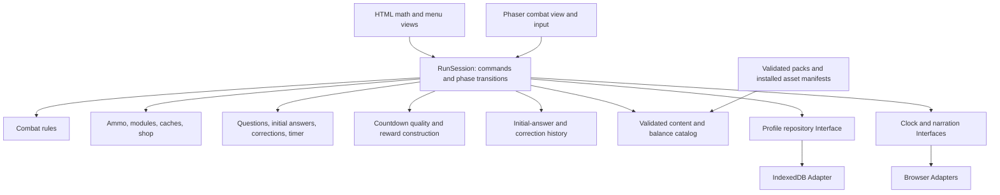
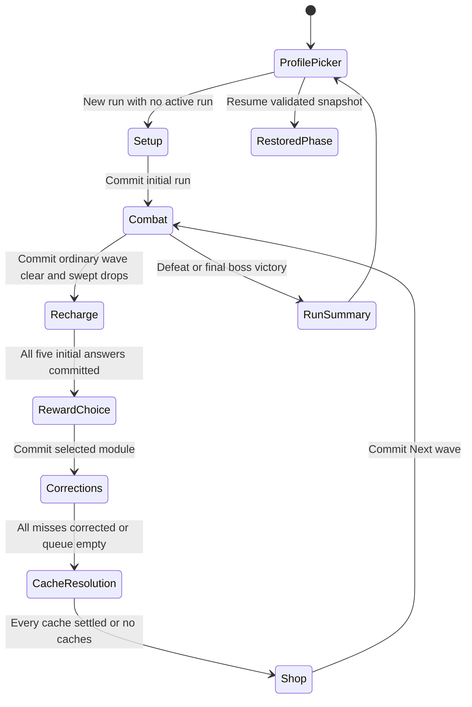
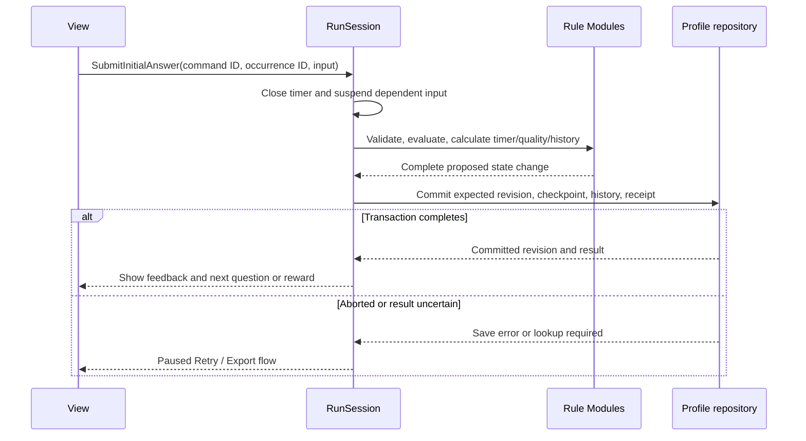

# Math on Mars — Architecture

Status: proposed implementation architecture, September 12, 2026. This document describes the planned system; the workspace currently contains planning documents and reference images, not an implemented game.

Updated September 13, 2026: personal-use MVP for home play, centered on the core run. Desktop, phone, and tablet support remain required, as do all K–6 tracks. Every quiz has five questions and one 30-second countdown; reward choice precedes mandatory untimed corrections. No educator assignment or formal learner study is a completion gate.

The product source of truth is [GAME_PLAN.md](/Users/tig/Desktop/tigran/mathonmars/docs/GAME_PLAN.md), referred to below as the PRD. Read it for gameplay rules, balance values, MVP scope, and confirmed versus provisional decisions. Consult [WIZARDGENIE_PROMPTS.md](/Users/tig/Desktop/tigran/mathonmars/docs/WIZARDGENIE_PROMPTS.md) only with its supersession notice: historical implementation prompts cannot override the current quiz contract. Use [QUIZCASTER_REFERENCES.md](/Users/tig/Desktop/tigran/mathonmars/docs/QUIZCASTER_REFERENCES.md) when implementing the educational screens. This architecture does not promote provisional product defaults to confirmed requirements.

[DESIGN_VALIDATION.md](/Users/tig/Desktop/tigran/mathonmars/docs/DESIGN_VALIDATION.md) and [design_checks.py](/Users/tig/Desktop/tigran/mathonmars/docs/design_checks.py) contain historical calculations. They are not acceptance proof for the current countdown/correction model. The current PRD and this architecture supersede their charge, pacing-profile, and learner-evidence proposals.

**1. System shape and technical decisions**

Build one responsive browser application for desktop, phones, and tablets with a Phaser combat view, HTML controls for math and menus, deterministic game rules, validated local content packs, and transactional local profiles. Support portrait and landscape touch play at launch. Deploy a static application; gameplay, answer evaluation, narration, and saving have no runtime backend or AI dependency.

| Area | Proposed implementation | Reason and boundary |
|---|---|---|
| Language | TypeScript with strict checking | Make phase, answer, inventory, and save contracts explicit; validate external data at runtime as well |
| Build | Vite, if compatible with the actual WizardGenie project | A small browser build; use the harness's existing build/preview configuration when required |
| Combat presentation | Phaser, version verified and pinned during the first integration | Continue the PRD's Phaser approach without assuming the older game's version applies |
| Math and menus | Semantic HTML/CSS with TypeScript controllers | Native focus, editable numeric fields, large buttons, and readable equations; no UI framework required initially |
| Mobile input/layout | Pointer Events, a virtual movement stick, responsive DOM layouts, safe-area-aware viewport mapping | Touch, mouse, and keyboard reach the same commands; mobile layout does not change simulation or scoring rules |
| Combat rules | A fixed-step simulation using plain data | Restore enemies, projectiles, effects, and cooldowns without serializing engine objects |
| Local persistence | IndexedDB through one repository Interface | Commit learning, run changes, and settlement receipts together |
| Offline delivery | Versioned static assets and a service worker on the published origin | Support downloaded content and bundled K–1 speech without live generation |
| Verification | Pure rule tests, repository fault tests, and browser flow tests | Exercise correctness, durability, and actual input/audio behavior independently |

Phaser supports scene lifecycle management; use scenes for loading and combat presentation, while the application owns the gameplay phase. This avoids treating an engine scene transition as a saved game transaction. [Phaser scene documentation](https://docs.phaser.io/phaser/concepts/scenes).

Vite supports a vanilla TypeScript starting point. Its use here is an architectural recommendation, subject to the actual harness runtime, rather than a claim about an existing project setup. Record resolved engine, toolchain, and runtime versions in the package lockfile and runtime notes when scaffolding. [Vite guide](https://vite.dev/guide/).

Start on the main thread. Keep the simulation small: circle/segment collision tests, a spatial lookup, explicit enemy state machines, and bounded effect processing. Do not introduce an entity framework, general scripting engine, worker messaging, cloud accounts, or server infrastructure for this scope. Performance measurements can justify a later change.

**2. Ownership and dependency boundaries**



`RunSession` is the only coordinator allowed to publish authoritative session changes. Domain Modules own their rules; views send commands and render projections. A Module exposes a small Interface and hides its internal representation. An Adapter connects an Interface to a browser capability. Clock, narration, and persistence are explicit Seams because both browser execution and controlled failure/timing tests need them.

| Module | Owns | Public Interface responsibilities |
|---|---|---|
| Application / RunSession | Active profile, command ordering, phase transitions, persistence coordination | Start/resume/end a run; dispatch commands; advance combat; publish a read-only view; save and switch profiles |
| Combat | Movement, enemy decisions, spawning, targeting, collisions, HP, shots, status effects | Advance a fixed step; snapshot/restore combat; report pickups and terminal outcomes |
| Progression | Cartridge ownership, active order, merges/forge, stat-module instances, salvage, caches, shop | Validate and preview transactions; return an exact resulting inventory/loadout/stat change |
| Practice | Question selection, numeric parsing, initial pass, correction queue | Create five fixed questions; record one initial answer each; require correct answers for every queued correction |
| Rewards | Countdown candidate tier, wrong-first-answer deductions, reward magnitudes | Freeze quality after five initial answers; construct three fixed choices; settle one reward before corrections |
| Learning | Simple profile-scoped practice history | Preserve original answers/correctness and separate correction outcomes; report initial accuracy without rewriting it |
| Catalog | Immutable, versioned definitions and readiness | Resolve a definition by pinned ID/version; validate pack, balance, asset, and audio references |
| Persistence | Storage schema, revisions, atomic commits, backups, migration, import/export | Load a valid profile; commit an expected revision; recover or explain an unsupported save |
| Presentation / media | DOM, sprites, animation, sound, focus, pointer/touch/keyboard routing, viewport and safe-area layout | Render application projections; translate input into the same commands; report narration readiness/completion/errors |

The rule Modules must not import Phaser, the DOM, IndexedDB, generation tools, or wall-clock APIs. Views must not calculate correctness, spend salvage, roll offers, increment capacity, or award learning credit. The repository validates storage envelopes and revisions; domain Modules validate game invariants. Avoid a global event bus that lets arbitrary listeners mutate the run.

Inject the catalog, repository, active-time clock, narration control, and seeded random streams at session creation. Tests use a controlled clock, deterministic content, and a repository Adapter that can fail before or after commit. Production uses the browser Adapters. Keep these Interfaces specific to this game.

**3. Authoritative data model**

Use serializable records with stable IDs. Engine objects, DOM nodes, audio objects, timer handles, and function closures never enter saves. Grouped inventory stacks are a view over individually identified cartridges; equipped references point to those same owned instances.

| Record | Required contents |
|---|---|
| Profile | Stable ID, nickname/avatar, selected grade/skill, settings including touch handedness and quality preference, storage revision, active-run ID or null, practice history, completed-run summaries |
| Run | ID, profile ID, interaction revision, phase/wave, mission preset, combat difficulty and capacity-ruleset ID/transition log, fixed skill/step and five-question set size, content/balance/reward versions and chosen policy record, RNG/shuffle bags, repeat history references, inventory/modules, salvage, pending intermission |
| Ammo inventory | Cartridge records keyed by ID; normal type and T1–T4 or legendary; ordered active IDs; capacity-purchase count; legendary-forged flag |
| Combat snapshot | Tick/remainder and any interrupted substep cursor, arena/HP/entities, positions/velocities, behavior/telegraphs, queued spawns/volley admissions/hit work, cooldowns, med-kit, drops, shots, projectile falloff/ledgers, slow durations and funded-burn state |
| Question instance | Occurrence ID, exact content key and operand/task signature, template/bank ID, skill/step, content version, operands/diagram data, canonical answer, accepted form policy, hint/explanation/audio references |
| Question attempt | Draft, narration substate, initial submission ID/answer/correctness, and separate correction submission IDs/answers/completion |
| Intermission | Stable ID, exactly five ordered instances, initial-pass index, elapsed active milliseconds and remaining countdown, wrong-first-answer count, frozen candidate/final quality, three fixed offers/chosen ID, and correction queue/cursor |
| Shop | Fixed offers/IDs, prices, purchased-slot flags, locks, refill generation, paid reroll count |
| Cache | Tagged choice cache (fixed option bundles, one selected option/disposition, closed receipt) or grant cache (fixed granted items and individual accept/sell receipts); fixed sale quotes |
| Learning event | Profile/run/occurrence IDs, grade/skill/step/content version, original first answer and correctness, and separate correction attempts/completion |
| Commit receipt | Command ID and payload identity, affected run/phase/offer IDs, resulting storage/interaction revisions, result summary; unique within a profile |

Store normal ammo tier, stat-module quality, and ammo capacity as different types. A single `rarity` field must not control all three systems. Store the selected module's actual modifier magnitudes and source (`math`, `shop`, or `cache`); derive aggregate stats from those instances. Do not repeatedly multiply already modified stats on load.

Core invariants enforced on commands and save validation:

- Exactly one weapon slot. Active ammo capacity equals one plus the purchase count, with zero to three purchases. Active references are owned, unique, and no longer than capacity; normal active ammo types are unique.
- Reserve ownership is independent of active capacity. Legendary consumes one active slot and may overlap normal types, but effect resolution selects the strongest version once.
- HP is fractional Suit Integrity; armor is a bounded mitigation stat. There is no additional shield pool. Increasing maximum HP preserves missing HP.
- One active run belongs to one profile. Grade and selected skill step remain fixed within that run; combat difficulty is separate.
- Each of exactly five questions receives one initial submitted answer. A wrong initial answer advances to the next question and counts once toward the current reward downgrade. Timer expiry never skips unanswered questions. Choose the reward after all five initial answers, then complete each missed question correctly in an untimed correction round before caches/shop/next wave. Corrections never change reward quality or initial accuracy. Each reward, cache settlement, purchase, merge, and forge settles once.
- Defeat, victory, and abandonment leave no resumable active run; submitted practice history and completed-run summaries survive cleanup.

IDs are allocated once and saved, not recreated during view construction. Use separate identifiers for question content and its occurrence in a run: practicing the same template later is a new occurrence; resuming the current occurrence is not.

**4. Phase machine and command contract**



`RestoredPhase` means the phase stored in the snapshot, not a new gameplay phase. Save & Exit can leave any active phase after a successful save. Abandonment can end any active phase after explicit selection. Pause, loading, saving, and error overlays suspend the underlying phase; they do not manufacture another intermission or lose the current question.

Recharge has explicit substates: `preparing`, `initialNarration`, `answering`, `feedback`, and `initialPassComplete`. Expiry clamps the shared countdown to zero and leaves unanswered initial questions mandatory; it is not a phase exit. A wrong answer advances without an immediate retry. Reward choice, corrections, cache resolution, and shopping are untimed. Corrections repeat each missed item until correct; help/explanation may support this round but cannot bypass a correct submission. An ordinary wave clears after all scheduled/queued spawns and enemies, including splitter children, are exhausted. Clear hostile projectiles, sweep loose ammo into reserve, fix the five-question set, and commit before revealing it. The final boss bypasses recharge; the internal three-wave slice ends on its last ordinary clear. Proposed simultaneous marine/boss death ordering is defeat when marine HP reaches zero in that simulation step; pin it in the rule version.

Commands include an ID, profile/run identity, expected phase and target identity, and an expected interaction revision. Examples are `SubmitInitialAnswer`, `ChooseReward`, `SubmitCorrection`, `RequestCorrectionHelp`, `ChooseCacheOption`, `ResolveGrantedCacheItem`, `BuyOffer`, `RerollShop`, `MergeAmmo`, `ForgeOmni`, `SetActiveAmmo`, `StartNextWave`, and `AbandonRun`.

Keep three counters distinct: simulation tick orders combat; interaction revision invalidates stale action previews after a committed domain command; storage revision increments on every successful database write, including periodic checkpoints. Draft edits, timer updates and periodic-save completion do not invalidate an otherwise-current answer/card action. RunSession owns the interaction revision; only the persistence queue supplies the latest storage revision to repository compare-and-swap. Check an existing command receipt and matching payload before fresh-command phase/revision guards, so a retried successful purchase still returns its original result after the offer or phase has changed.

The command handler returns a committed result or a typed failure such as `wrongPhase`, `staleOffer`, `invalidIngredients`, `capacityReached`, `insufficientSalvage`, `contentUnavailable`, `saveFailed`, or `profileInUse`. It never partly spends currency and then reports failure. A repeated command ID with the same payload returns its stored result; reuse with different payload is rejected. UI-supplied remaining time, reward quality, correctness, capacity, or resulting stats are never accepted as authoritative.

On every screen transition, release previous input bindings and require held pointers/keys to return to neutral before accepting the next action. A final Enter press or answer tap cannot also choose the first reward. Preserve focus deliberately, clear combat input on blur or touch cancellation, and pause combat whenever the math/menu phase owns input. Pointer IDs and a held virtual stick are transient: restoring a run always starts with neutral controls.

**5. Combat simulation and effect composition**

Use a proposed 60 Hz simulation step, independent of rendering. The simulation owns positions, collision dimensions, spawn timers, and effect timers. Phaser interpolates and animates its output; Arcade Physics is not a second authority moving the same entities. This choice makes exact snapshot restoration practical for the small enemy roster. Reassess it during the three-wave proof if the harness imposes a different physics integration.

Use stable entity-ID ordering for simultaneous collisions and target ties. Projectiles need swept segment tests so fast rounds do not skip small slimes between steps. Keep a spatial lookup for nearby enemies and rebuild its derived indexes on restore. The lookup, sprite pools, shadows, particles, and camera shake are not persistent game state.

A step processes an explicitly fixed order: spawn/behavior updates; movement and weapon cooldown/fire; ordered direct impacts and their allowed chain effects; status damage; deaths/splits/drops; pickups; terminal wave checks. Define any later ordering change as a simulation-rule version change. Frame stalls use a bounded catch-up budget; hidden time is discarded. Use the pinned standard/compact capacity rules below before overload becomes sustained. A repeatedly overloaded compact session fails the minimum-device acceptance check; do not loop endlessly between pause and Resume.

Confirmed ammo semantics: reusable ammo types modify the continuously fired projectiles, equipped effects combine, and legendary uses one active slot. Ammo ownership is not a finite bullet count. The one weapon builds an immutable shot payload from current stats and equipped ammo:

1. Resolve normal and legendary effects into one strongest value per effect type.
2. Snapshot D, volley count/total damage budget, per-impact piercing falloff, chain limits/damage, Frost, Fiery funding budget, and the explicit Omni capacity-rate bonus in the firing interval.
3. Allocate one `shotId` shared by every projectile in the volley, with a shared chain ledger.
4. Direct projectiles keep their own hit-target IDs and remaining piercing count. The first direct impact starts the shot's only chain; initialize its visited set with that impact target so the chain cannot jump back to its origin.
5. Each chain jump selects a new target within range of the preceding target and consumes the shared budget. Chain hits can apply Frost/Fiery but cannot launch another chain, pierce, or create projectiles.
6. Burns use a per-target remaining-damage reservoir R and rate v, with R/v ≤ three seconds, and remaining per-shot funds B initialized to f×D. Before a hit, account for damage already burned through that timestamp. For hit damage H, compute `nextRate = max(v, f×H / 3)` and `added = min(B, max(0, 3×nextRate − R))`. If added is zero, leave the burn unchanged. Otherwise debit added from B, set remaining damage to R+added, and set rate to nextRate; the resulting duration is `(R+added)/nextRate`, at most three seconds. A partially funded stronger hit can shorten duration while raising the rate, but cannot create unpaid damage. For a new burn use R=v=0. Each tick deals `min(R, v×activeDelta)` and debits the same amount; remove exhausted burns. Preserve simulation remainder on save. Across hits/ticks, total damage dealt plus outstanding damage cannot increase by more than the shot's debited funds. Burn ticks emit no hit effects. Frost independently retains its strongest slow and uses half strength against bosses.

Keep the chain and burn-funding ledgers until all projectiles and pending hit work belonging to that shot are gone. Save projectile hit histories/falloff indexes, chain budget/visited IDs, unspent burn funds, per-target remaining burn damage/rate, durations, and tick progress. Pooling a visual projectile must not reuse its gameplay ID while it remains referenced. Balance values come from the PRD's ammo table, not duplicated constants in rendering code.

At purple, a volley still has at most 25 direct plus four chain hit events, but the revised damage envelope is 3.1D direct + 0.8D chain + ≤0.9D funded burn = ≤4.8D lifetime crowd damage. Multi Shot's first-impact volley is 1.6D total, not five times 0.6D; pierce impacts decay by 0.5 each. The explicit Omni stabilizer can multiply firing rate by up to 1.12, giving a conservative sustained funding envelope of 5.376D×r for constantly fresh crowds, before passive changes already represented in D and r. This is not measured DPS or isolated-boss DPS. Track hit fraction, target count, overkill and burn non-stacking in the combat harness before completing the combat content. An ammo pickup affects future shots only.

**Capacity-ruleset contract.** Read caps from the PRD's versioned standard/compact ruleset (initial live-enemy caps 80/40, live-damaging-projectile caps 160/80, pending-hit caps 256/128). Count pending splitter children and boss summons as queued spawn budget rather than bypassing the limit. At capacity, queue spawns; admit a complete volley only when projectile capacity permits, then debit its firing cooldown. Never emit half a volley. Drain admitted hit work in stable order before advancing the next simulation tick; a pending-hit limit controls admission, not damage deletion. Save queues and admission/cooldown state. Compact changes temporal density, so its balance reports and timings are separate. A checkpointed ruleset transition may grandfather existing objects until below the new caps; it records old/new IDs and never deletes them. A render-quality change alone cannot edit these rules.

Queue length is not a bound on total work in a tick. Generate collisions incrementally with a saved stable cursor and drain the admitted queue without dropping work; if the per-render work budget expires, continue that same substep on the next frame before advancing simulation time. Gate this on measured input/tick latency, not just entity counts. Give every projectile a finite lifetime/range, allow at most one pending volley per emitter, and use stable fair admission between player/enemy emitters so deferred cooldowns do not accumulate a burst. Validate that every authored volley fits the smallest supported projectile cap and every spawn budget is finite. Test a full queue, blocked boss volley, splitter saturation, ruleset switch and eventual wave clear; failure to drain or persistent backlog blocks the capacity ruleset.

Use independent saved random streams for combat/spawning, loot, shop, practice, and math-reward offers. Cosmetic particles use a separate stream. Preserve fixed outcomes as records as well as stream state: re-entering a screen must not reroll a cache or reward. The guarantee is continuation from a snapshot under compatible rules; do not promise identical simulations across engine/rule versions without verification.

**6. Ammo, equipment, and economy transactions**

Progression exposes preview and apply operations using the same validation path. “Atomic” means an indivisible domain change; only the explicitly durable boundaries below imply an IndexedDB commit. Combat pickups may roll back with the last combat checkpoint, together with their corresponding loose-drop state. A preview identifies consumed instances, exact output, active-slot changes, salvage cost, and any redundant effects. Confirmation revalidates against the current revision; a stale preview cannot consume replacement ingredients silently.

| Operation | Result and persistence boundary |
|---|---|
| Combat pickup | Add the fixed instance and auto-equip a new type only with a free slot, as one in-memory step. Persist in the next periodic checkpoint or wave-clear transaction; no per-pickup IDB write/freeze |
| Normal merge | Consume two selected matching type/tier instances below purple; create one next-tier instance; replace an equipped ingredient in its existing slot when applicable |
| Legendary forge | Consume exactly one selected purple of each of the five types; create Omni; reconcile active references/order; set the once-per-run flag and receipt |
| Equip/reorder | Update ordered references to owned instances within capacity; preserve all reserve ownership |
| Sell ammo | Require unequipped, sellable ammo; remove the selected instance and add salvage together |
| Buy Ammo Expander | Validate capacity and offer; spend salvage; increment purchases once; invalidate and replace capped expander offers once |
| Buy/accept stat module | Save actual modifiers and derived stat change in the owning shop/cache settlement |
| Choose cache option | Choose one option and accept or sell its complete fixed bundle; atomically create the two ammo instances/module or credit its sale quote, close all alternatives and save the cache receipt |
| Resolve granted cache item | Accept or sell one already-granted item exactly once; this operation rejects choice caches |
| Reroll/refill | Replace eligible offers, save new fixed offers and stream state, and update currency/counters together |

Forge checks owned inventory, including equipped copies, so it works at capacity one. Auto-equip legendary and preserve all unconsumed cartridges. If no consumed ingredient frees space in a full loadout, replace the lowest-priority active slot shown in the preview; its former cartridge remains owned. Legendary cannot be sold, split, forged twice, randomly acquired, or fed into another merge. Other equipped ammo adds no duplicate effect power. While Omni is equipped, derive the proposed +4% fire-rate stabilizer per purchased capacity slot, maximum +12%, once; redundant equipped references neither improve nor disable it. Save the purchased count and rule version, not a repeatedly compounded multiplier.

Ammo Expander is a shop-only discrete utility effect; it is outside module quality and modifier magnitude rules. At capacity four, remove invalid expander offers including locked ones, replace each affected slot once without charge, and keep the paid reroll count. Distinguish purchased-slot tracking from slot replacement: invalidating an offer is not a purchase toward the four-purchase free refill. The fourth purchase triggers one free four-slot refill in the same transaction, retaining the paid reroll count.

Keep wave drop weights, prices, resale values, cache tables, shop eligibility, and stat caps in versioned balance data. Guarantee the first clear's eight salvage and the reserved 8-salvage Expander offer until purchased; this reserved offer supersedes rerolls and counts as an ordinary purchased slot. Purchased slots stay empty until all four slots in that refill generation have been bought; rerolls never reset those flags. Supply milestones create a choice cache with six mutually exclusive options: five fixed blue pairs and one green base-magnitude module. Save its selected option/disposition and close the entire cache atomically. A capped fixed cache module retains its quoted sell action instead of rerolling. Ten blue cartridges from five distinct choices suffice for the recipe, but the first cache also allows wave-one purple; compare that progression with staged tiers before approving this proposed economy. Optional ammo uses a persisted five-type shuffle bag. Batch normal merge remains one previewed, durable command.

Author 18 module variants within six families, each with actual ordered modifiers. Proposed prototype tuning: white grants half the first base modifier; green grants the first at base magnitude; blue adds the second; purple adds the third. White magnitude is tuning, not an owner-confirmed value. There is no time/charge multiplier within a quality. Math offers require positive actual gain for each promised modifier, three distinct variants, and at least two first-stat priorities; prefer an unseen variant. RewardChoice permits no other stat-changing transaction and preserves its offers through corrections. Shop purchases deterministically replace/save newly invalid shop offers without counting replacements as purchases; fixed caches retain their sell route. Validate reachable late-run states including repeated white rewards. If three useful math offers cannot be made, revise the catalog/caps/economy rather than showing zero-value choices. Keep math modules separate from ammo/Expander/legendary. Use provisional full-mission balance fixtures to test acquisition and DPS before finished art.

**7. Math content and answer evaluation**

Separate authored definitions, compiled validated packs, and runtime question instances. Each pack records subject, grade, skill/step, content version, bounded item forms, answer policy, hints/explanations, and required media. Support all K–6 tracks in the personal-use MVP. Automated arithmetic/content validation and direct functional inspection remain required; an external educator and formal learner study are not prerequisites.

K–1 uses finite banks with bundled narration and structured counting/number-line diagrams. Grades 2–6 may use deterministic templates with bounded operands and computed answers. Validate all finite-bank answers, generated operand boundaries, narration references, and the actual fraction/decimal input flows. Content changes get a new version and rerun affected checks.

At intermission creation, save exactly five question instances for every grade, using the selected skill and available review history. Preserve exact IDs, operands, diagram data, answer policy, and audio references through reload. Prefer varied items and avoid immediate exact repeats when possible; there are no promotion eligibility windows, evidence watermarks, or minimum participant requirements. Append simple presentation history when an item is actually shown or spoken.

Use a numeric parser, not expression evaluation. Whole numbers are integers; decimals and fractions normalize to exact rational values. Reject malformed input, zero denominators, and unreasonably long fields. An incomplete field produces validation feedback and is not an answer submission; during the initial pass the countdown continues. Fraction equivalence follows the item's declared policy, including reduced-form requirements. Generate mathematical diagrams from structured data; artwork never supplies operands, labels, or answers.

Each initial submission is final for initial accuracy. Save it, append a missed occurrence to the correction queue if wrong, then advance. After all five are answered, freeze reward quality and show the three choices. Commit the chosen reward before opening the untimed correction round. Repeat queued questions until correct, preserving original answers separately. Correction help/explanations are available without changing the earned reward. There is no skip, End recharge, answer-reveal settlement, immediate scored retry, or route to shopping with unfinished corrections. Save & Exit preserves the phase; explicit Abandon ends the run normally.

**8. Shared countdown, rewards, and practice history**

One 30-second countdown covers the complete initial pass, for every grade and input method. Start at the first actual item reveal or item-specific speech, whichever comes first. Use a monotonic active-time clock; persist accumulated elapsed milliseconds and derive `remainingMs = max(0, 30000 - elapsedMs)`. Do not reset for a new question, wrong answer, narration replay, reload, or rotation. Initial and replay narration count while the quiz is active; answer entry and Check remain enabled during speech. Question transitions are immediate; loading pauses timing while the task is concealed. Generic instructions and preload occur before the first exposure.

Proposed interruption handling retains the existing pause contract: pause/hidden/save-error/major relayout suspends active time, conceals the task, stops speech, and requires a usable resumed screen. Transaction processing freezes dependent input and timing until committed, so storage latency does not consume the player's budget. Preserve the timer at command acceptance and reject duplicate/stale submissions. A pause-reason set prevents a late narration callback from restarting a hidden or saving session. Preload required speech; a media failure pauses with retry rather than swapping an attempted question or resetting the clock.

Freeze the candidate when the fifth initial answer is accepted, using unrounded remaining time:

| Remaining time | Candidate quality |
|---|---|
| More than 20 seconds | Purple |
| More than 10, up to and including 20 seconds | Blue |
| More than zero, up to and including 10 seconds | Green |
| Zero | White |

For each wrong initial answer, drop the candidate one tier on the ordered ladder white → green → blue → purple, with white as floor. For example, 21 seconds remaining with one wrong gives blue; exactly 20 seconds gives blue before deductions; exactly 10 seconds gives green before deductions. At zero the player still submits all remaining initial answers, then chooses a white reward. Show the countdown and current candidate/deductions clearly; rounding the displayed seconds never changes thresholds.

Persist the initial wrong count, frozen remaining time, candidate/final quality, reason, fixed offers, chosen reward, and correction queue. Reward settlement and correction settlement are separate idempotent commands. An incorrect correction stays in the queue; a correct correction removes/completes that occurrence exactly once. Neither can alter initial answers, the wrong count used for quality, or reward magnitude.

Practice history records grade/skill, each original answer and correctness, and separate correction attempts/completion. Initial accuracy is original correct answers divided by submitted initial answers; a later correction never turns an initial error into an initial success. Preserve submitted history on defeat/abandon without fabricating answers to unseen items. Grade/skill selection stays explicit; adaptive promotion, dual evidence windows, pacing calibration, charge, strength scaling, normalized set sizes, and accuracy streaks are outside this MVP.

**9. Persistence, settlement, and recovery**

Treat the profile as one logical transaction boundary, even if IndexedDB stores partition its physical data. Use one database with profile-keyed records for profile metadata, practice-history events, run checkpoints, and command receipts. Transactions that cross these records use the same IndexedDB read/write transaction and acknowledge success only on transaction completion. Prepare domain results before opening the transaction and avoid unrelated asynchronous work inside it. [IndexedDB transaction guidance](https://developer.mozilla.org/en-US/docs/Web/API/IndexedDB_API/Using_IndexedDB).

The repository Interface exposes `loadProfile`, `commit(expectedRevision, commandId, changes)`, `saveCheckpoint`, `exportProfile`, and validated `replaceProfile`. A commit either returns its durable result or a typed error. On an uncertain result, reload the receipt for the same command ID before retrying. Never retry an uncertain purchase with a freshly generated ID.



For a critical command, stop advancing dependent gameplay, validate a complete next state, commit it with history/receipts, and only then publish the result. Critical commands include initial answers, correction submissions, reward choices, phase transitions, cache/shop/equipment operations, and terminal cleanup. Combat pickups remain checkpoint-only changes. Commit an initial answer, captured countdown, wrong count, next-question index, and correction-queue addition together. The fifth answer also freezes quality and offers. Reward choice commits the selected module and transition to corrections together; a correction commits its separate history and queue progress without touching initial accuracy or reward. Keep a failed candidate available for retry/export, distinguished from the last committed state.

Combat steps use an owned in-memory state without writing every frame. Every five active combat seconds, enqueue an immutable checkpoint. One persistence queue serializes checkpoints and critical commands; coalesce waiting periodic checkpoints. When a queued write starts, it uses the queue's latest storage revision, not a revision captured earlier with the snapshot. Completing an older checkpoint updates only that durable revision marker and must not overwrite newer in-memory combat or invalidate the interaction revision. Before a critical operation, freeze at a step boundary, finish the pending write, and commit the current frozen state. A cross-tab compare-and-swap conflict pauses for reload; never retry stale state against a new revision. This prevents a delayed autosave from restoring spent ammo or overwriting an answer.

Save & Exit and profile switching wait for the final snapshot to commit. On page hide/blur, pause immediately and attempt a checkpoint; do not depend on tab-close handlers for durability. A crash can roll back uncheckpointed combat, as allowed by the PRD, but it must not roll back an acknowledged learning or equipment transaction.

**Backup and terminal-state consistency.** Keep current and backup checkpoints, each with a critical-commit epoch and history/receipt watermark. A critical transaction writes two validated copies of its post-command checkpoint alongside the new watermark. Periodic combat saves may rotate the previous checkpoint into backup within that same epoch. A backup is resumable only if its epoch and watermark match the latest committed profile metadata; never combine an old pre-reward run with newer history/settlement records. Defeat/victory/abandon commits the summary, history, and terminal marker and invalidates both resumable checkpoints together. Terminal metadata prevents an older backup resurrecting the run.

Validate versions, IDs, references, numeric bounds, and domain invariants before accepting a save. Migrate a copy and keep the original exportable until validation succeeds. If current is invalid, try a compatible backup. If neither run checkpoint is valid, retain valid learning data, explain the lost resume capability, and offer a new run. Do not infer a replacement grade, regenerate offers, reset timing, or silently start over.

Acquire an exclusive browser lock for a profile while it is active; a second tab shows that the profile is in use. Use a per-profile revision comparison inside every database commit as a second guard. If lock support is unavailable in a supported browser, revision conflicts must pause the stale session and require a reload before further play. Lock support and this fallback need browser acceptance testing. [Web Locks API](https://developer.mozilla.org/en-US/docs/Web/API/Web_Locks_API).

Selected-profile export includes versioned metadata, practice history, recent presentations, settings, summaries, and the active checkpoint/receipts including initial countdown and correction state. Import first validates and previews the target profile replacement, then replaces only that profile in one transaction after the explicit selection required by the PRD. Acquire the same writer lock and allocate a new storage revision so an older tab cannot overwrite imported data. Content and asset files remain separately versioned dependencies; the export names the versions required to resume.

**Origin eviction is outside transaction recovery.** Implement the PRD's iOS installation guidance, adult-facing automatic-deletion notice, persistence-status check and portable backup flow. WebKit documents activity-based ITP deletion and heuristic persistence support; do not translate that into a guaranteed seven-calendar-day expiry or a guarantee that Home Screen installation prevents all loss. [WebKit ITP policy](https://webkit.org/blog/10218/full-third-party-cookie-blocking-and-more/), [WebKit storage policy](https://webkit.org/blog/14403/updates-to-storage-policy/).

After a committed run end/abandon, prepare an export snapshot automatically. Use a gesture-backed Save backup/share/download action; attempt auto-download only when enabled and supported, and show backup-needed on cancellation/failure. Store export-attempt time separately from adult-confirmed external backup; a generated Blob/requested download is not verified recovery. Browser/installed contexts may need explicit export/import migration. Verify restoring an external file after deleting all origin stores/caches, not just restoring the second IndexedDB checkpoint. If all origin data disappears, the app cannot reliably infer prior users or regenerate lost history. Keep Restore backup discoverable on the first screen. Test supported Safari inactivity behavior separately from synthetic eviction, and record the outstanding observation if not completed.

**10. Rendering, mobile controls, and audio**

Use a small Phaser boot/loading scene and a combat scene. The combat scene builds or restores visual objects from the current snapshot and disposes them on exit. DOM screens implement profile/setup, initial quiz, reward selection, corrections, cache/shop/loadout, and run summaries. Keeping the same application phase owner prevents a visible quiz overlay from leaving enemies or cooldowns running behind it.

The combat view positions one separate Pulse Blaster sprite at the marine's shoulder mount; body animations remain empty-handed. Active ammo changes projectile/VFX composition and the ammo HUD, never gun count. Use logical collision dimensions independent of trimmed frame bounds. Render pools may be recycled without altering persistent entity IDs or hit histories.

Use the PRD's visual authority order: Backwoods for spatial composition/readability, Goblin Gutter for smooth rendering/animation, and Quizcaster for educational layout. After approval, the Math on Mars reference sheet resolves visual conflicts. The sheet is not yet created or approved. Future hub imagery does not add a hub to launch scope.

The ten original Backwoods screenshots are preserved in [references/backwoods/](/Users/tig/Desktop/tigran/mathonmars/references/backwoods/); the PRD's reference section lists their filenames and source folder. Use these local copies alongside [references/quizcaster/](/Users/tig/Desktop/tigran/mathonmars/references/quizcaster/) during visual review. Reference images are development inputs and stay outside the shipped runtime asset bundle.

Math screens render explicit Check and Replay controls with visible focus; the correction round also offers help/explanation. Initial wrong answers advance, and initial items cannot be skipped. Keypad and physical keys route through the same input parser. Fractions have labeled numerator/denominator fields; decimal entry has an explicit decimal key. Use text labels and pips for module quality, T1–T4 for ammo, and a separate capacity indicator. Do not bake labels into generated UI frames. Keep countdown animation and decorative effects away from the answer field.

**Touch input and interruption handling**

The keyboard and touch Adapters both emit a normalized movement vector plus discrete med-kit/pause commands. Use a floating virtual stick in the configured lower thumb zone, with a dead zone and vector magnitude capped at one so diagonal movement does not gain speed. Reserve separate pointer IDs for movement and action buttons; a second finger can use a med-kit without stealing the stick. Mirror the control zones through the profile's handedness setting. Automatic aiming/firing remains the same weapon behavior on every device.

Use Pointer Events and pointer capture for a movement gesture. On `pointerup`, `pointercancel`, lost capture, blur, or a phase change, clear the appropriate held input; losing the movement pointer always returns movement to zero. Do not add a second touch/mouse event path that also submits the same tap. [Pointer Events and capture](https://developer.mozilla.org/en-US/docs/Web/API/Pointer_events).

Restrict `touch-action: none` to the combat gesture surface that needs to own movement. Menus, explanations, shop lists, and profile screens retain normal scrolling and zoom; never disable these for the whole document. A scrolled/cancelled card gesture must not fire its Choose/Buy action. Use explicit buttons and release-based activation for discrete actions, with the existing command IDs and settlement guards. [Touch gesture handling](https://developer.mozilla.org/en-US/docs/Web/CSS/Reference/Properties/touch-action).

**Responsive viewport and camera contract**

Keep world units, collision dimensions, weapon ranges, movement speed, wave budgets, and reward rules independent of CSS pixels and display density. Presentation owns the world-to-screen transform and its inverse; touch coordinates are mapped through the current canvas bounds, safe-area offset, and camera transform. Updating this transform must not change enemy positions, reset the wave, reseed randomness, or reconstruct the current quiz.

Define the playable rectangle after HUD, thumb zones, and device-safe padding. Fit the camera to retain a tested minimum threat-preview distance along the shorter playable axis; do not center-crop a desktop canvas or shrink actors below readable gameplay size. Place control zones outside the main threat-reading area where space permits. Warnings for offscreen attacks need visible edge/directional cues before damage is possible. Verify approaching enemies, Spitter shots, Charger windup, and boss telegraphs on the smallest accepted portrait and landscape views. This camera/readability contract must be proven during the first touch combat slice.

Size layouts from the available viewport, not a fixed desktop resolution. Use device-width viewport configuration and safe-area insets for browser/device edges. The Visual Viewport API can report changes to the visible area when a keyboard or zoom changes it; combine that with container resize handling and a fallback to available element bounds. [Visual Viewport](https://developer.mozilla.org/en-US/docs/Web/API/VisualViewport), [CSS safe-area environment values](https://developer.mozilla.org/en-US/docs/Web/CSS/Reference/Values/env).

Rotation or a major persistent viewport change pauses simulation and countdown timing, conceals the item and stops its speech, clears gestures, preserves the draft and initial/correction progress, and requires Resume after relayout. Minor browser-toolbar animations should update padding without repeatedly opening a pause overlay; if a task/action becomes obscured, suspend its timer until usable again. Do not reset elapsed time when rotating. Audio finishing during relayout cannot bypass the pause-reason set.

Use a compact countdown/tier strip and one-column question layout in portrait; use question/keypad columns when landscape height is limited. Primary task, answer, and Check remain visible together at the PRD's baseline sizes. Reward cards, four shop offers, grade tiles, ammo groups, and forge ingredients reflow into scrollable lists or grids without removing choices. Keep the explicit action outside accidental scrolling gestures and avoid fixed bottom panels that cover the final row. Use the PRD's 48 CSS-pixel minimum hit areas, larger K–1 keypad target where possible, and readable text sizes as layout constraints.

The built-in keypad is the primary touch math input; avoid summoning an OS keyboard as well. Preserve semantic labels/focus and test physical-keyboard and assistive input access. Profile names use native text entry. If a keyboard appears, reposition/scroll the active field and its action within the visible viewport, preserve the draft, and pause scored timing while the task is obscured. No core action depends on hover, right-click, or inventory dragging.

**Mobile graphics and media budget**

Separate canvas backing resolution from CSS layout. Begin with a configurable pixel-ratio cap of two, then measure and lower it on constrained devices. Pool short-lived VFX, keep speech decoding scoped to needed clips, and reduce cosmetic particles or render scale before changing gameplay. Keep the 60 Hz simulation when rendering at 30 frames per second. Cosmetic quality cannot delete spawns/hits or edit rewards; the separately versioned compact ruleset controls admission/density, with a checkpointed transition when selected. Test both instead of relying on an overload pause as the normal fallback. Record texture/decode memory, save stalls, frame times, and sustained thermal behavior on the agreed minimum phone models.

Narration is an application-controlled channel separate from music and combat effects. Unlock audio through onboarding, preload required clips before revealing an item, and report completion/errors to RunSession. After app switching, screen lock, or an audio interruption, require a user gesture to recover audio if the browser needs it, and keep scored timing suspended until required narration is ready. Cancelling or switching profiles cancels the previous narration; late callbacks carry occurrence/session IDs and are ignored if stale. K–1 cannot enter scored play with missing required speech. Load only the current speech clips into decoded audio memory while retaining the downloaded pack for offline use.

**11. Content delivery and WizardGenie pipeline**

WizardGenie is a development-time asset pipeline, outside the player runtime. The production app consumes installed files and verified manifests, never generator URLs, API keys, pending generation jobs, or live model responses. Confirm current tool schemas, costs, and harness runtime before production generation; this architecture does not authorize a paid batch.

The pipeline follows the prompt pack: candidate masters → selected masters → approved Math on Mars reference sheet → character registration and animation through the current AutoSprite workflow → Corridor Key extraction → retained PNG sheets and returned metadata → integration manifest → verification in play. Preserve source IDs/URLs and original metadata. Keep `candidate`, `selected master`, `animated`, `keyed`, `integrated`, and `verified in play` as distinct statuses.

The engine-facing asset manifest records stable asset ID, file/content version, frame dimensions/grid/count, origin, display scale, playback rate, loop/one-shot behavior, optional event frames, and separate shadow metadata. Validate these against the actual delivered sheets; never infer a requested frame count was delivered. Initial PRD targets are 96-pixel marine/slime frames shown around 72 pixels, 192-pixel boss frames shown around 144 pixels, and a 4096-pixel texture-dimension budget, subject to the first visual proof.

The educational speech manifest is separate: clip ID, exact spoken-text ID, language/narrator, content version, file hash, and validation status. The build checks every K–1 prompt, correction hint, and explanation reference and every unique spoken text. Check speech against the question; artwork approval alone does not validate arithmetic.

Include validated, replayable K–1 speech for reward priorities and cache/shop/loadout/next-wave actions. Use fixed descriptions and tier/identity cues, with dynamic numerical detail available as text; do not enumerate every fractional stat result as a required prerecorded clip. Verify the complete intermission without adult reading help. This UI narration is additional to the current math/onboarding audio estimate and must enter the actual manifest/quote.

For the published game, a service worker caches the static shell and versioned assets over HTTPS. Its lifecycle handles downloading a new build separately from activating it; do not force a new application version into an active run. [Service worker lifecycle and caching](https://developer.mozilla.org/en-US/docs/Web/API/Service_Worker_API/Using_Service_Workers).

Install a content pack into a versioned staging cache, verify required files, then mark it ready. Cache storage and IndexedDB readiness markers are not one atomic transaction, so revalidate required files at use and recover interrupted installs. Show a pack as offline-ready only after the shell, combat assets, questions, and required speech are available. All seven validated tracks must ship, even if a device downloads their speech on demand; an unavailable pack cannot begin a run until ready.

Pin content, balance, simulation-rule, reward-rule, and asset-manifest versions for each run. Retain dependencies referenced by any profile's active run when cleaning caches. On an update, either support those versions, apply a tested migration, or show the PRD's unsupported-resume explanation while preserving learning/export. Do not quietly resolve old IDs against newly changed definitions. A harness preview that cannot exercise service-worker scope is not evidence that published offline behavior passes.

**12. Planned repository layout**

All planning documents are stored in `docs/`: `GAME_PLAN.md` is the PRD, this file describes architecture, the older prompt pack and screen-reference notes retain reference material with supersession notices, and `DESIGN_VALIDATION.md` with `design_checks.py` preserves historical calculations rather than current quiz acceptance checks. Keep future planning documents in `docs/` as well. Reference images remain under repository-root `references/` and are not runtime assets. Paths inside copyable prompts are relative to the repository root.

`docs/` and `references/` below exist today; `src/`, content/build directories, and tests are the proposed implementation layout. Keep rule tests next to the Module they exercise; browser journeys and cross-Module fixtures live under `tests/`.

```text
docs/
  GAME_PLAN.md                 # PRD: gameplay, mobile requirements, MVP scope
  ARCHITECTURE.md              # runtime boundaries, data/save contracts, this layout
  WIZARDGENIE_PROMPTS.md        # asset and implementation prompts
  QUIZCASTER_REFERENCES.md      # screenshot observations and UI applications
  DESIGN_VALIDATION.md          # historical calculations; superseded quiz rules
  design_checks.py              # historical planning checks; not current quiz tests
src/
  main.ts                      # composition root and browser Adapter wiring
  application/                 # RunSession, commands, phase machine, view projections
  combat/                      # simulation, enemy state machines, collision/effects
  progression/                 # ammo, forge, equipment, stats, shop, caches
  practice/                    # question selection, numeric parser, attempts
  rewards/                     # countdown quality and free-module construction
  learning/                    # initial-answer/correction history and reports
  catalog/                     # validated definitions and version lookup
  persistence/                 # repository, IndexedDB Adapter, migrations, export
  presentation/
    phaser/                    # boot/combat scenes and entity-to-sprite mapping
    dom/                       # math, profiles, reward/shop/loadout screens
    styles/                    # shared tokens, focus and layout rules
  platform/                    # clock, keyboard/touch, viewport, narration, profile lock
  offline/                     # service-worker registration and pack readiness
content/
  source/                      # authored templates, skill maps, speech scripts
  reviewed/                    # validated pack definitions and check records
  balance/                     # versioned waves, ammo, drops, prices, stat caps
assets/
  sources/                     # retained source metadata and selected masters
  manifests/                   # installed visual/audio metadata and provenance
public/
  packs/                       # compiled validated content and bundled narration
  assets/                      # installed runtime textures, sound, music
scripts/                       # content compilation and manifest validation
tests/
  fixtures/                    # versioned saves, seeds, validated boundary items
  integration/                 # command/persistence failure and migration cases
  browser/                     # desktop/mobile layouts, input, audio, resume, offline
references/backwoods/          # ten preserved Backwoods screenshots
references/quizcaster/         # existing preserved screenshots
```

Keep balance values in `content/balance`, validated instructional data in `content/reviewed`, and runtime schemas with their owning Modules. This document defines boundaries and invariants; avoid copying every table of tuning values from the PRD into another specification. The build must copy only installed runtime assets and validated compiled packs into the distributable output.

**13. Verification and implementation sequence**

Test owning Module Interfaces and real user flows. Use bounded arithmetic cases, deterministic inventory/economy fixtures, and fault injection for saves. This is personal-use MVP verification, not a formal learner trial or educator sign-off process.

| Concern | Required checks |
|---|---|
| Answers/content | All K–6 inputs; operand boundaries; zero denominator; exact decimals and equivalent fractions; finite-bank answers; matching narration/diagrams |
| Countdown/reward | Exactly five questions; one 30-second timer; boundaries at 20, 10, and zero seconds; each wrong initial answer drops one tier to white; no timer reset; rounding does not affect quality |
| Corrections/history | Wrong initial advances; all five initial answers before reward; reward before corrections; misses repeat until correct; no shop/next wave while pending; corrections never overwrite initial accuracy or change reward |
| Persistence | Reload at every initial item, zero-time continuation, reward choice, and correction; no duplicate error/queue entry/reward; failed or uncertain writes; backup epoch consistency; two tabs and sibling profiles |
| Ammo/combat | Reusable combined effects; one-slot legendary; reserve/merges/forge; stable swept collisions; burn conservation; bounded queues and eventual wave clear; terminal ordering |
| Shop/economy | Fixed cache/offer outcomes; exclusive choices; useful white-through-purple rewards; refill/capacity rules; collector route and no-forge white-floor viability |
| Browser/mobile | Keyboard/keypad; both orientations; real safe areas; move plus med-kit; cancelled gestures; touch forge; pause/narration/rotation recovery; responsive countdown and correction screens |
| Offline/backup | Pack readiness, published update with active run, external export/import and deliberate origin-deletion recovery; clear local-storage failure handling |
| Visual/audio | Gameplay-size readability; color-independent cues; all question/reward/correction/shop controls and speech function |

Target 60 rendered frames per second on capable devices and sustained 30 or more on the minimum tested mobile hardware without persistent simulation backlog. Select concrete desktop, iOS Safari, Android Chrome and tablet targets during the first combat proof. Record frame/input/save latency and memory during the busiest combined-ammo wave and a full session. Check real devices as available; record any untested device limitations honestly. There is no required participant count, pacing-calibration study, or retention-observation study before personal use.

Follow the PRD's six implementation steps:

1. Establish the runnable browser project and three-wave responsive combat slice. Verify actual harness/package versions and prove desktop/touch movement and med-kit with one gun and white Piercing.
2. Implement five questions, the shared countdown, four quality bands, wrong-first-answer drops, reward choice, and mandatory untimed corrections. Start with grade 3, then cover all K–6 tracks.
3. Complete local profiles and resumable phases, including atomic initial/reward/correction settlement, backups, and defeat/abandon cleanup.
4. Complete ammo/shop/forge, adjustable acquisition tuning, useful module variants at all four qualities, and white-floor progression checks.
5. Integrate remaining enemies/boss, approved art, narration, and responsive screens; check standard/compact performance on available devices.
6. Exercise complete win/defeat/correction/save paths and focused rule tests, including offline/update and export/import behavior where supported. Report untested devices honestly; formal education/retention studies do not block this personal MVP.

Integration unknowns remain the harness/build versions, concrete device matrix, generated animation metadata, and narration size. Reference-sheet approval remains part of the asset workflow. Reusable combined ammo, one-slot legendary, home core-run scope, and the countdown/correction rules are confirmed. Optional post-forge bonuses, acquisition schedules, mission-length choices, and exact reward modifier magnitudes remain tuning or proposals unless separately confirmed.

**14. Future expansion boundaries**

Keep subject, grade, and skill/deck distinct in content IDs and menu data now. Add a new answer evaluator, input view, practice-history policy, and timing policy only when a validated non-math subject is implemented; do not build a generic quiz-authoring platform for launch. Render only available validated content in the Mission terminal.

A future hub and permanent armory would add profile-level combat progression separate from both active-run inventory and learning records. Cloud sync would require its own identity/conflict model; the local revision check is not a cloud sync protocol. Controller support would add an input Adapter and another usability pass. Phone/tablet touch controls and responsive screens are already part of the first release. Future changes can use the established boundaries without enlarging launch scope.
