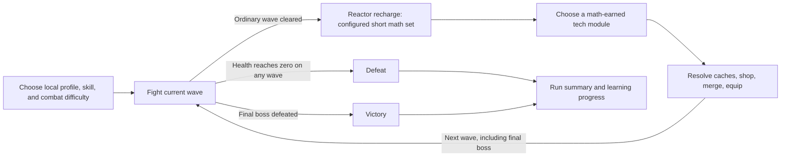

# Math on Mars — game plan draft

Working title. Revised after design review. Product and asset planning only; no game implementation or paid generation has been started. All numbers below are initial playtest values, not validated balance.

September 13 update: desktop, phone, and tablet browser play are first-release requirements. Touch combat and responsive educational/shop screens are included in launch scope. Planning documents live in `docs/`; screenshot references remain in the repository-root `references/` directory.

Implementation companion: [ARCHITECTURE.md](/Users/tig/Desktop/tigran/mathonmars/docs/ARCHITECTURE.md) defines the proposed runtime, Module boundaries, data model, transactional saves, content delivery, and verification sequence. This plan remains the source of truth for product requirements and provisional choices.

September 13 design review: the revisions below make support suggestions, timing exposure, reward strength, acquisition, backups, and mobile limits explicit. The latest owner instruction is that a wrong answer steps the current quiz reward down one tier. The proposed handling of wrong retries, a sustained-accuracy route, and the shorter K–1 default are called out in section 6 and section 4; they are not recorded as owner-approved choices. Numerical derivations and the live narration quote are in [DESIGN_VALIDATION.md](/Users/tig/Desktop/tigran/mathonmars/docs/DESIGN_VALIDATION.md).

**1. The game in one sentence**

A lone space marine survives waves of alien slimes on Mars, then solves short math challenges to charge the fabricator and choose stronger equipment for the next wave.

The experience should feel like Goblin Gutter: move, dodge, collect loot, build a powerful combination of ammo effects on one automatically firing weapon, and survive increasingly dangerous waves. The core changes are the science-fiction setting, a math challenge between waves, and ammo-driven weapon progression.

**2. What is established, and what is provisional**

| Established by the request | Provisional recommendation |
|---|---|
| Space marine versus slimes | Working title: Math on Mars |
| Math between combat waves | Proposed K–1 default: three questions; grades 2–6: five, normalized to the same reward scale |
| Faster correct answers produce better upgrades; a wrong answer lowers the current quiz reward one tier | Accuracy supplies most charge; speed adds a capped bonus; see explicit downgrade and proposed accuracy-route rules |
| A reviewed practice track for every grade K–6 at first public release | Separate curriculum milestones, all required before launch; broader coverage later |
| Keep speed-based upgrades; omit relaxed mode from the first release | A capped bonus with no answer deadline |
| WizardGenie asset workflow | Smooth illustrated 2D sprites through AutoSprite V3 |
| One weapon slot with upgradeable ammo | One Pulse Blaster; ammo pickups act as reusable run-long cartridges |
| Piercing, Multi Shot, Electric Chain, Frost, and Fiery ammo, upgradeable through purple | Merge two copies of the same type and tier to advance one tier |
| One purple of each of the five types merges into legendary ammo with all effects | Consume those five stored cartridges; legendary occupies one active ammo slot |
| One active ammo type initially; a shop trinket increases capacity up to four | Each Ammo Expander purchase adds one capacity, up to three purchases per run |
| Similar to Goblin Gutter | Keep automatic combat, loot, merging, passive trinkets, and the four-offer shop |
| Looks and plays well on mobile screens as well as desktop | Support phone/tablet touch play in portrait and landscape; validate responsive layouts and performance on real devices |

Confirmed in the review: speed continues to improve upgrades, relaxed mode is excluded from the first release, and all seven grades must have reviewed practice tracks before public launch. A limited-grade internal prototype is a development step, not a reduced launch commitment.

Confirmed in the ammo revision: one weapon slot, the five named ammo types, upgrades through purple, the five-purple legendary recipe, and shop-trinket capacity growth from one to four active ammo types. Working defaults: ammo is reusable for the run rather than a finite bullet count; equipped effects combine on each shot; the legendary cartridge uses one active slot. These implementation details are proposed defaults, not explicit user selections, and remain adjustable.

Still provisional: core run versus full hub experience, breadth within each grade, and home/classroom/demo audience. This draft assumes the core run and home use with an adult selecting the starting level. The reward numbers and release-gate thresholds below are revised proposals for testing.

**Implementation policy record.** Before a milestone uses an unresolved rule, record the chosen prototype policy and its version; before release, record the owner's disposition. An example or implementation prompt is not approval. Use the speed-only route unless the accuracy streak is adopted. Three-item K–1 samples may be tested internally; the Short/K–1 launch recommendation is still pending. Counting every wrong submission is the current prototype interpretation, including retries. The guaranteed blue-pair supply schedule and post-forge stabilizer are balance proposals to test in milestone 5, not established user requirements. Keep these choices in the run's pinned policy record so saves and pilot results identify the actual rules used.

**3. What to carry over from Goblin Gutter**

The earlier [game design document](/Users/tig/Desktop/gauntlet/goblin-gutter/docs/GDD.md) describes a desktop browser, single-player, top-down survival game with automatic attacks and a persistent hub. Its [art guide](/Users/tig/Desktop/gauntlet/goblin-gutter/docs/ART_STYLE.md) specifies smooth chibi illustration, strong outlines, simple cel shading, and a slight overhead view. These are design references; this planning pass did not audit which features are implemented today.

The later “Plan battle trinkets feature” task adds two useful user decisions: accepted trinkets become run-long passive effects outside inventory, and buying all four shop offers refills the shop for free. Carry those rules into the new design, with tech terminology.

| Goblin Gutter element | Math on Mars equivalent | First release |
|---|---|---|
| Hero | Marine in a fixed exploration suit | One character |
| Auto-attacking weapon slots | One weapon slot; one to four active ammo slots | Replace the multi-weapon loadout |
| Goblin Grunt | Drifter Slime: direct pursuit | Keep behavior |
| Dart-Thrower | Spitter Slime: ranged attacks | Keep behavior |
| Shaman and summons | Brood Slime: creates small slimes | Later |
| New enemy behavior | Splitter Slime: divides on defeat | One of the four launch enemy types |
| Troll Rider | Charger Slime: telegraphed rush | Simplified elite |
| Bosses | Slime Overmind | One boss initially |
| Coins | Salvage | Run currency |
| Chests | Supply caches | Resolve after combat |
| Trinkets | Tech modules | Passive effects for the current run |
| Potion / Flask | Med-gel / carried med-kit | Keep the distinction |
| Weapon merging | Merge matching ammo type and tier; five distinct purple types forge legendary | Adapt to ammo progression |
| Camp and merchants | Orbital outpost, engineer, med-bay, hangar | Expansion |
| Teeth, stash, crafting | Research credits, armory, fabrication | Expansion |

The launch roster is Drifter, Spitter, Splitter, and Charger, plus the Overmind boss. The Brood is a separate deferred summoner, not another name for the Splitter. Mini-slimes are small Drifter derivatives rather than a fifth full enemy archetype.

Keep math difficulty independent of combat difficulty. A sixth-grade learner who is new to action games should be able to play easy combat; a younger child should not receive harder math merely for surviving more waves.

**4. The session loop**

1. Start with one Pulse Blaster in the only weapon slot, a basic suit, one white Piercing cartridge installed in the initial ammo slot, and a selected math skill track. The specific starter cartridge is a tuning default.
2. Fight an ordinary wave with a proposed 30–45 second spawn schedule, followed by cleanup of remaining enemies. Movement and positioning matter; the weapon aims and fires automatically with its active ammo effects. Collect ammo cartridges into the run's ammo reserve.
3. Freeze combat completely. Clear hostile projectiles and save the wave outcome before opening the math screen.
4. Solve the configured set, presented one question at a time on a calm, readable reactor console: proposed three for K–1, five for grades 2–6.
5. Show how much reactor charge came from correctness and how much came from speed. Offer three tech modules at the earned quality; choose one for free.
6. Resolve collected supply caches, then open the four-offer salvage shop. Select exactly one option from each milestone choice cache; ordinary loot caches resolve their granted items individually. Buy cartridges or trinkets, merge ammo, and choose the active ammo loadout. The shop also sells the Ammo Expander that increases active ammo capacity.
7. The player explicitly selects “Next wave.” Shopping and explanations are untimed.
8. The final boss ends the run directly. Do not require a math round after victory or defeat when there is no next-wave upgrade to use.

First playable slice: three waves and two five-question grade-3 intermissions, plus a three-question narrated K–1 sample. Proposed mission presets are Short (six waves, boss on six) and Standard (ten waves, boss on ten). Mission length and combat difficulty are explicit settings available independently of grade; changing a math grade never edits enemy HP. Recommend Short with three-question sets for K–1, pending the owner's response; recommend Standard with five-question sets for grades 2–6. Save and resume split a mission across sittings. No countdown forces the target duration.

| Grade | Proposed default / questions in a clear | Target uninterrupted sitting | Planning estimate for a full mission, including shopping |
|---|---|---|---|
| K | Short / 15 | 5–10 minutes | 15–25 minutes, usually split |
| 1 | Short / 15 | 5–10 minutes | 15–25 minutes, usually split |
| 2 | Standard / 45 | 10–15 minutes | 30–45 minutes |
| 3 | Standard / 45 | 10–15 minutes | 25–40 minutes |
| 4 | Standard / 45 | 15–20 minutes | 35–50 minutes |
| 5 | Standard / 45 | 15–20 minutes | 35–55 minutes |
| 6 | Standard / 45 | 15–20 minutes | 35–55 minutes |

These estimates are scheduling hypotheses, not measured age norms. A K–1 ten-wave/five-question run can plausibly take 45–60 minutes or longer; remove the previous 25–35-minute promise. For example, 45 items at 25 seconds of solve exposure plus 15 seconds of help/feedback average take 30 minutes, nine shops at 90 seconds add 13.5, combat adds six, and setup adds two: 51.5 minutes. Short at 15 items, five shops averaging 60 seconds, 3.5 minutes combat and 1.5 setup is about 20 minutes under the same item-time assumptions. Observe each component rather than compressing all non-answer activity into 40 seconds per break. Offer Save & Exit prominently at each break; a planned stop/resume is not disengagement.

**Structured cadence observation, not a causal experiment.** Use three internal six-wave configurations with a wave-six boss and a direct wave-five-to-six transition: A has five questions after waves 1–4 (20 total); B has ten after waves 2 and 4 as two sequential five-item rewards (20 total); C has three after waves 1–4 (12 total, four normalized rewards). Record interruption duration, question exposure, and upgrade arrival; B changes multiple factors and C changes question dose. These sessions cannot isolate a cadence effect or estimate population preferences from a small pilot. The primary observation is unplanned quit-at-math-boundary count divided by math boundaries reached, with the stated reason and planned save/stop separated. Counterbalance order when practical and use the observations to identify a fix, not to declare a statistically superior arm. Mission/set changes remain versioned product decisions.

**5. Math should feel like powering the marine's equipment**

The console language is brief: “Charge the reactor,” “Question 2 of N” with the actual set length, “Correct!”, and “Choose your upgrade.” Show each item's displayed contribution on the same normalized scale as the rail: multiply both its correctness and speed components by 5/N. For example, an unhurried first correct contributes 20 in a five-item set and 33⅓ in a three-item set; do not label raw points as normalized charge. Preserve exact values internally and round only display. Show the actual math clearly. Flavor text should not add reading work to every arithmetic question.

Use the supplied [Quizcaster question screenshot](/Users/tig/Desktop/tigran/mathonmars/references/quizcaster/02-math-question.png) for layout: progress above a central question, an answer field, and a full keypad arranged 7–8–9 / 4–5–6 / 1–2–3 / Backspace–0–Check. A left-side Reactor charge rail shows our three labeled/pipped reward tiers and settled charge; use a horizontal version when needed for a narrower viewport. It does not drain earned charge while the learner thinks. Show the configured three- or five-question set length; the screenshot does not determine our cadence. The [screen-reference notes](/Users/tig/Desktop/tigran/mathonmars/docs/QUIZCASTER_REFERENCES.md) specify the transfer to our console and distinguish observations from proposed behavior.

Use counting objects and visual groups for K–1, with a full large 0–9 keypad, backspace, and an explicit Check/Submit action. Learners construct their answer rather than selecting from a short list containing the correct answer. Keyboard and on-screen keypad are equivalent input methods. A K comparison item can ask for the number of objects in the larger group. Fractions need numerator/denominator fields; decimals need a decimal key. Partial input is never submitted automatically.

Scored recharge items in this release use constructed numeric answers, including answers entered by tapping the keypad. Multiple-choice recognition activities may appear inside hints or explanations, but do not earn correctness or speed charge. Do not add a minimum-response-time trick and call it proof of understanding: a fast or lucky answer alone is not mastery. If scored recognition items are added later, define and validate their own reward and evidence policy before using the numeric-entry speed rule.

**Spoken support and K–1 content pipeline**

K–1 must work for a pre-reader after the initial profile/setup assistance. A bundled narrator reads the task aloud automatically; Replay repeats it. Provide spoken button guidance during onboarding and narration for hints and worked explanations. Keep visible text and diagrams available alongside speech. Prompts describe the task without revealing the answer: “How many energy cells are there?” does not name the quantity to count.

That independence also covers the break after the quiz. Provide replayable reviewed speech for reward priorities, ammo identity/tier, cache selection, buying, equip/merge/forge previews, Next wave, and Save & Exit. Use fixed short descriptions of what a choice does and its quality; exact changing stat totals remain visible and exposed to assistive technology. Bundled speech must not depend on generating a clip for every possible fractional stat value. Count these additional unique UI texts in the speech manifest and budget; the 20 onboarding clips in the current estimate do not cover this work. Test a pre-reader through quiz → reward → cache/shop → next wave, not just answer entry.

Compile the deterministic K–1 templates into a finite, versioned bank of reviewed question instances for launch. Bundle a complete spoken prompt, hint, and explanation for each unique text, reusing identical audio clips. This trades some package size and generation work for predictable offline speech and avoids a browser voice being a hidden launch dependency. Use one selected narrator and a pronunciation guide for numbers and operators. Runtime selection still shuffles the reviewed bank deterministically; it never generates unreviewed spoken math.

The developer owns the item/audio manifest and missing-file checks; a designated elementary-math reviewer verifies the spoken and displayed question, correct answer, hint, and explanation together. The product owner must name that reviewer before approving a grade pack. Do a small narrated K–1 sample during the loop prototype, before batching audio or later content. A missing or failed K–1 narration disables that item with an adult-facing diagnostic; it cannot silently fall back to text-only scored play.

Use **solve exposure time**: start at the first reveal of the actual problem/diagram or item-specific speech, whichever occurs first. Required initial narration counts toward this time; input may be composed but Check waits for initial playback to finish. K–1 therefore cannot solve during a free three-second lead-in. Targets are calibrated with that audio duration included. Item-specific Replay also counts as exposure, even with the visual problem concealed; it gives no hint penalty by itself. Genuine pause conceals the problem and stops speech, and excludes that interval. Generic onboarding, silent loading, post-answer feedback, and worked explanations are excluded. Save/resume preserves accumulated exposure and adds any repeated item narration; it never grants a fresh timer. Apply the same exposure policy when narration is enabled for older grades. Full narration remains a K–1 launch gate.

**K–1 bank capacity and repeat spacing.** Minimum reviewed instances: K counting 66 (six layouts for each quantity 0–10), K comparison 110 (two layouts for each of 55 unequal unordered quantity pairs), K compose/decompose 84 (four layouts for each of 21 ordered pairs totaling at most five); grade-1 addition 80, subtraction 80, and missing-addend 80. Total: 500 instances. Balance operands and answers within each bank; a layout change is not a new mathematical skill. The compiler rejects duplicates masquerading as bank growth and checks these counts. Do not claim this eliminates repeat practice.

Store profile-scoped recent presentations across runs: exclude the last 30 exact item IDs within a skill, and avoid the last eight operand/task signatures where the mathematical space permits (counting uses the last four quantities). A shown answer cannot be used as an immediate fresh assessment item. Prefer least-recently-presented candidates; if a small reviewed step exhausts its allowed candidates, relax operand spacing explicitly before exact-item spacing, label it repeat practice, and exclude too-soon repeats from promotion evidence and the proposed accuracy streak. A generic repeated instruction clip may be reused; it must not uniquely announce an answer before the problem is shown. Narration cost and human review effort are estimated in DESIGN_VALIDATION.md; batch only after the manifest gives the actual unique-text count and quote.

An exact item key identifies content, not a run occurrence: use a bank entry's stable key for K–1 and template/version + operands + task/representation for generated items. An operand/task signature excludes cosmetic layout. Reserve planned choices against one another when making a set, but update presentation history only when an item is actually shown or spoken; unseen End-recharge items do not displace history. Keep support observations from repeat practice even when those items are ineligible for accuracy/promotion. Validate spacing per selectable **step**, not just per skill's total bank: repeated-session traces must continue to produce ten eligible answers and then five new eligible answers after a dismissed suggestion. A step permanently trapped in spacing relaxation fails content acceptance; enlarge/restructure its reviewed bank or revise the declared spacing policy before release. The 500-item minimum alone does not prove this condition.

Use deterministic, reviewed question templates with computed answers and explanations. Runtime AI is unnecessary for the first release. Store a skill ID, operand limits, answer type, worked explanation, and pacing target with each template. Do not generate educational diagrams or equation text as image assets.

**Proposed launch track by grade — all seven required**

| Grade | Initial skill coverage | Example |
|---|---|---|
| K | Count 0–10; compare quantities; compose/decompose within 5 with pictures | Count four energy cells |
| 1 | Add/subtract within 20; find a missing addend | 8 + ? = 13 |
| 2 | Add/subtract within 100; place-value reasoning | 47 + 26 = ? |
| 3 | Multiplication and exact division within 100 | 6 × 7 = ? |
| 4 | Multiply larger whole numbers; equivalent fractions and like-denominator sums | 3/8 + 2/8 = ? |
| 5 | Decimal operations; adding/subtracting unlike-denominator fractions | 1/2 + 1/4 = ? |
| 6 | Ratios/unit rates; positive-fraction division; one-step equations | x + 7 = 19 |

This is a selected practice track, not a complete K–6 curriculum. The [Common Core math standards](https://www.thecorestandards.org/wp-content/uploads/Math_Standards.pdf) are a useful starting reference for grade tags; the final content requires a standard-by-standard review. Full coverage would also include geometry, measurement, data, reasoning, and word problems. Grade six also includes statistics and rational-number concepts beyond this starter track.

**Learning rules**

- The adult or learner selects a local profile, grade, and skill before a run. An optional short placement activity can come later.
- A five-item set mixes three selected-skill and two review items; a three-item set uses two selected-skill and one review item. With no history, use the selected skill throughout. Items stay within the pinned reviewed step rather than silently changing difficulty.
- A wrong first submission gives a specific hint and one retry. The retry has no speed bonus. After another miss, show a worked answer and Continue; never trap the player in an endless retry loop.
- “Hint” is available before submission and makes any subsequent correct answer assisted. Each item permits at most two scored submissions. “Show me how” is also available and reveals the worked explanation without awarding correctness points. “End recharge” finishes early with the charge already earned; unattempted questions count as zero.
- Revisit missed skills in later intermissions using new numbers. Do not immediately award new mastery credit for repeating the exact answer just shown.
- Track first-attempt correctness, assisted correctness, and skipped/revealed items separately. A displayed answer is not evidence of mastery.
- Keep the selected grade and skill step fixed for the current run. Suggestions take effect only when accepted before a later run; review items do not silently promote or demote the learner.
- Maintain two windows per profile/skill/step/compatible content version. **Accuracy:** the latest ten distinct, spacing-eligible first submissions without prior help; first wrong stays wrong after retry. Hint-before-first, reveal, or skip without a submission is excluded, never mislabeled as a wrong answer. **Support need:** the latest ten distinct presented-and-settled opportunities, including prior help, assisted outcomes, reveals, explicit skips, and unanswered presented items ended by End recharge/abandon. Unseen trailing items receive zero reward but do not fabricate support observations. Count a support-needed flag once per opportunity if help, reveal, skip, or unresolved failure occurred.
- Only the skill deliberately selected for that run can produce a run-end suggestion; review evidence is retained for later selection. At most one suggestion appears. If ten support observations contain six or more support-needed items, offer prerequisite practice even with zero eligible first submissions. Otherwise, with ten accuracy observations, offer a harder step at 9–10 correct, retain at 6–8, and offer prerequisite practice at 0–5. Support takes priority if windows disagree. At the first step, offer another representation/guided practice instead of an impossible lower step. This is a support recommendation, not proof of low ability.
- Evaluate only at completion or abandonment. After acceptance/dismissal, require five new presented-and-settled selected-step opportunities before another support offer; promotion/accuracy offers additionally require five new eligible first submissions. Save both watermarks. Do not issue four review-skill prompts or repeat a dismissed offer without new evidence. An all-assisted learner now reaches a concrete support suggestion after ten presented items. These are product heuristics, not a validated assessment.

- Save learning progress even if the marine loses. Report practice by skill, with first-attempt accuracy and help used. Do not present gameplay score as a school grade.

**6. How correctness and speed improve upgrades**

Keep speed-based upgrades and no relaxed mode. Per item: first unassisted correct earns 20 plus a 0–5 speed bonus; assisted correct earns 15 once; revealed/skipped/unresolved earns zero. An incomplete or malformed entry is input validation, not a wrong answer, and consumes no attempt. A mathematically wrong scored submission increments `wrongSubmissionCount`, even if its retry later succeeds.

`speedCharge = 5 × clamp((2T − solveExposure) / T, 0, 1)`

Normalize by the planned set length N, including unattempted zero items: `charge = 5 × sum(itemCharge) / N`, maximum 125. Three all-assisted items and five all-assisted items both normalize to 75. Preserve exact fractions; round only display. Ending a three-item set after one fast answer yields 41⅔, not 125. Never infer mastery from this normalization.

| Normalized charge | Base quality | Modifier count |
|---|---|---|
| 0 to under 60 | Green / Standard | 1 |
| 60 to under 110 | Blue / Advanced | 2 |
| 110–125 | Purple / Overcharged | 3 |

**Continuous strength across the whole range.** Every math-earned card multiplies its first modifier by `1 + 0.5 × charge / 125`. Additional modifiers stay at base magnitude. This replaces the old ramp that saturated at 60. At charge 0/30/59/60/75/100/109/110/125, the multiplier is 1.000/1.120/1.236/1.240/1.300/1.400/1.436/1.440/1.500. Thus all-assisted and all-unassisted unhurried sets produce different actual gains even within blue. Apply the factor once to a saved instance, including after a tier downgrade; shop/cache instances retain ordinary values. Offer construction avoids a capped first stat swallowing this increase.

For a math offer, require remaining first-stat headroom of at least **1.50 × its base modifier**, regardless of this set's charge; every additional modifier promised by its quality must also have a positive actual gain. Nonzero first-stat headroom alone is insufficient: +1% room makes both a +10.4% and +11.2% damage award yield only +1%. Keep applied values unrounded, and show enough precision in the gain detail to distinguish them. Test eligible variants under both 75 and 100 charge at the same inventory state. Reward choice precedes other stat-changing transactions, so its three saved cards cannot be rerolled by shopping while the choice is pending.

**Wrong-answer tier drop — latest owner instruction.** A wrong answer lowers this intermission's final upgrade one tier, with green as the floor. Previously earned equipment, HP, salvage, and ammo are unchanged. Working detail pending clarification: count every mathematically wrong scored submission, including a wrong retry. First compute the quality that accuracy/speed would earn, then apply `finalTier = max(green, candidateTier − wrongSubmissionCount)`. The UI shows the candidate, the visible drop, and final offer quality; provisional rail predictions cannot overwrite the saved charge. Wrong answers cannot create a tier below the guaranteed green reward. Hint-first without a wrong submission has no wrong-answer drop; support tracking makes that strategy visible without pretending it is an incorrect response.

**Proposed sustained-accuracy route, awaiting owner choice.** Two consecutive complete sets with every item correct on its first unassisted submission earn a purple candidate on the second set and each later qualifying set. Require the same selected skill/step, compatible content, set length, and spacing-eligible items; count every item in the set, including review. A hint, wrong response, reveal, skip, or early end resets the streak. An interrupted set carries across Save & Exit; a new run starts a new streak. Speed can produce purple immediately and still improves first-modifier strength, while an unhurried accurate learner can reach purple on the second qualifying set. If this proposal is declined, record explicitly that permanently slower accurate play has a blue ceiling under the speed route; removing relaxed mode alone does not resolve that product choice. Store whether purple came from speed or streak; a pacing gate cannot pass using a streak award.

Five-item examples under the proposed rule (no prior streak unless stated):

| Outcomes | Charge | Candidate → final quality |
|---|---:|---|
| Five unassisted, no speed bonus | 100 | Blue → blue; purple on second qualifying streak set if adopted |
| Five unassisted, full speed | 125 | Purple → purple |
| Five Hint-first correct, no wrong submissions | 75 | Blue → blue, first modifier ×1.30 |
| Four fast plus one Hint-first correct | 115 | Purple → purple |
| Four fast plus one wrong-then-correct | 115 | Purple → blue for the wrong submission |
| Four fast plus one revealed/skipped before an attempt | 100 | Blue → blue |
| Three fast plus two Hint-first correct | 105 | Blue → blue |
| Three fast plus two wrong-then-correct | 105 | Blue → green (two drops, green floor) |

For the speed route, five unassisted answers need ten bonus charge total: equal exposure/T ratios of 1.6 suffice. Four unassisted plus one Hint-first answer need 15 bonus charge across four: equal ratios of 1.25 suffice. It is **not necessary** for all four to be at or below 1.25T: ratios 1, 1, 1, 2 also supply 15 bonus charge. Sum separately clamped bonuses. If the assisted item followed a wrong answer, the new downgrade prevents purple regardless of that speed total. A three-item set with two fast plus one Hint-first normalizes to 108⅓, blue. Report such set-length differences in the pacing pilot.

**Pacing ownership and release gate.** T is a reward-balance parameter. The educator reviews mathematical suitability, wording, audio and item complexity; the product/gameplay owner owns T and its feasibility test. Record targets by skill step/task form, actual answer-entry method and narration exposure profile; do not ship the old blanket 10-second/25-second placeholders as validated values. Before locking each released pacing profile, collect at least 20 unassisted correct exposures from at least two learners, retain sample counts and median/IQR exposure/T, and flag cells with insufficient evidence. Every grade on its primary input method must have a pilot learner earn a **speed-route** purple at least once on fresh, appropriate-step items without staged assistance or hand-picked easy review. Inspect low-confidence and slow-accurate cases separately. This is a feasibility check, not a population fairness claim; revise and rerun failing profiles.

Input targets are not a setup choice. The first answer-edit event records keyboard versus touch/pointer keypad; every later editing event is recorded. At submission use that actual method's target; mixed-method editing uses the smallest applicable T, so typing after choosing touch cannot claim a slower target. Clicking Check alone does not reclassify keyboard editing. Include deletes, field edits, paste and accessibility input; unsupported/unclassified input uses a disclosed conservative calibrated profile until separately tested. Save method history and exposure across resume; changing methods never resets time. Do not block legitimate accessibility input to police scores.

Reward selection is untimed: choose one of three distinct authored module variants at the final quality, with exact gains and resulting stats. Keep charge, accuracy/speed contribution, and any wrong-answer drop visible. Prevent held keys/taps crossing the transition, preserve offers across resume, and settle once. Charge and downgrade affect only this free module, never cache/shop quality or ammo rarity. The green floor remains available at zero charge. Validate basic progression against repeated floor rewards after applying the new penalties.

Timing uses first problem exposure, including initial/item-specific replay speech as defined in section 5. Genuine pause/hidden/loading excludes time only while the problem is concealed and item speech is stopped. There is no deadline; slow unassisted correct still earns 20. General feedback and reward animations are untimed. All timing, normalization, streak and downgrade rules carry a reward-policy version.

**7. Combat and upgrades**

Desktop movement uses WASD or arrows, with automatic attacks, Q for med-kit, and Escape for pause. On phones and tablets, provide a floating virtual movement stick in a lower thumb zone, automatic aiming/firing, a separate large med-kit button, and an always-reachable pause button. Support moving and using a med-kit with different fingers at the same time. Offer a mirrored control arrangement for left- or right-handed use. Provide a brief tutorial for the current input method and visible focus for keyboard use. Touch combat is required at launch; controller support can follow.

**Mobile layout and playability — launch requirements**

Support the complete run on desktop, phones, and tablets, including profile/setup, combat, every K–6 answer format, reward choice, caches, shop, ammo reserve, merging/forge, and Save & Exit/Resume. Portrait and landscape both work without requiring fullscreen or an orientation lock. The same weapon, ammo, normalized reward policy and selected mission/set configuration apply across input devices. Grade may recommend a shorter set; a phone alone does not change question count. Pacing calibration uses actual entry method and narration exposure, and is a release gate; mobile does not imply a relaxed mode.

| Screen or behavior | Mobile requirement |
|---|---|
| Combat view | Recompose the HUD and reserve thumb-control space. Keep the marine, projectiles, enemy silhouettes, and warning geometry readable. Preserve enough visible approach distance to dodge; never merely crop a desktop view or shrink the entire HUD |
| Touch interaction | Use at least 48×48 CSS-pixel hit areas with separation; aim for 56-pixel keypad keys for younger learners where space allows. Move with one thumb; med-kit and pause remain reachable. No required hover, right-click, or drag-only inventory actions |
| Recharge | Use a compact horizontal charge rail. Keep the current question/diagram, answer, and Check action visible together; use a single column in portrait and question/keypad columns in short landscape layouts. Explanations may scroll. The full keypad includes decimal/fraction controls when needed |
| Reward and shop | Reflow three reward cards and four shop offers into readable rows or a vertical list. All offers remain available; scrolling is allowed and does not select a card. Show exact gains/costs and use an explicit Choose/Buy action |
| Ammo and forge | Wrap active slots and grouped reserve rows; tap to select/equip/merge instead of requiring drag-and-drop. Show all five named forge ingredients and the resulting loadout in a readable, scrollable preview with an explicit Forge action |
| Text and framing | Start with at least 16 CSS-pixel body/input text and larger math text; measure actual reading usability. Keep controls clear of notches, rounded corners, home indicators, and browser bars. Retain zoom in document/menu screens and avoid horizontal page overflow |
| Interruption | Rotation or a major viewport change pauses play and answer timing during relayout, preserves the draft answer and accumulated time, and requires Resume. App switching/screen lock pauses and attempts a save. Cancelled touches cannot leave movement held or trigger a delayed purchase |

The built-in keypad is the default touch math input so an OS keyboard does not unexpectedly hide the task. Profile-name entry still supports the OS keyboard. If a keyboard opens for any field, keep the focused field and its action visible and preserve the draft. Scrolling a card list must not count as choosing an upgrade, and the final answer tap must not carry into reward selection.

Initial layout checks cover 320×568 and 360×640 CSS-pixel phone viewports, their landscape counterparts, larger phones, and tablets around 768×1024; include actual browser chrome and safe areas. These are test targets, not claims that device support has been verified. Test real iOS Safari and Android Chrome devices plus a tablet before launch, alongside desktop browsers. Select and record minimum supported OS/browser versions and representative device models during the first playable slice.

Target 60 rendered frames per second where practical; require sustained, responsive play at 30 or more on the agreed minimum mobile devices during the busiest planned wave and a full-session soak. Lower cosmetic particles, render resolution, and decoded asset memory before altering combat rules. Cosmetic quality settings keep simulation and rewards unchanged. A separately declared, versioned compact combat ruleset may cap simultaneous entities and schedule the remaining wave budget over time, as specified below; it cannot silently delete damage or rewards during overload. Mobile readiness is a release gate, not a later polish pass.

| Enemy | Readable silhouette | Gameplay purpose |
|---|---|---|
| Drifter | Round lime blob, one bright core | Basic pursuit and crowd pressure |
| Spitter | Tall pear shape, visible nozzle-like mouth | Slow, telegraphed ranged shots |
| Splitter | Two-lobed purple body, two visible cores | Breaks into two weaker mini-slimes |
| Charger | Wide amber wedge with shell ridges | Directional charge with at least one second of warning |
| Slime Overmind | Large magenta dome around a contained reactor core | Alternates slam rings, projectile fans, and limited summons |

**One weapon, configurable ammo**

There is exactly one weapon slot, occupied by the Pulse Blaster in the first release. Its base damage, fire interval, and projectile speed can benefit from passive trinkets; firing patterns and elemental effects come from ammo. The former Scatter Emitter and Arc Coil weapon designs are replaced by Multi Shot and Electric Chain ammo. The proposed visual is one separate gun sprite on a single shoulder-side mount, so the marine's body animations remain empty-handed. There are no extra guns when ammo capacity increases.

Distinguish three concepts: the weapon slot holds the gun; active ammo slots determine effects the gun fires; the ammo reserve holds collected cartridges, including ingredients not currently equipped. A cartridge is reusable for the current run and is consumed only by merging, selling, or run-end cleanup. It does not count down with each shot. If every active slot is empty, the blaster still fires ordinary rounds with no special effects.

The reserve has no separate item-count limit in this release. Present it as grouped stacks by ammo type and tier with an equipped marker, rather than a large bag grid. Reserve ownership includes equipped cartridges; equipping does not create a second copy. Allow one active cartridge per ammo type, up to the current capacity. Other copies remain available for merging or selling. Collecting a new type fills a free active slot automatically; otherwise it enters the reserve without displacing the loadout. Duplicates do not auto-merge. Swapping, selling, and crafting happen between waves, with the initial loadout chosen before combat. Players can own all five types even at capacity one.

**The five ammo effects and normal tiers**

White T1 → Green T2 → Blue T3 → Purple T4 improves the same named effect. D is base shot damage after passive damage modifiers; r is shots per active second after fire-rate modifiers. The following replaces the old 0.6D-per-pellet/no-pierce-falloff proposal. It is an arithmetic-bounded starting point, not verified gameplay balance.

| Ammo | White T1 | Green T2 | Blue T3 | Purple T4 |
|---|---|---|---|---|
| Piercing | 1 extra target | 2 extra | 3 extra | 4 extra |
| Multi Shot | 2 pellets, 1.15D total first-impact budget | 3, 1.30D total | 4, 1.45D total | 5, 1.60D total |
| Electric Chain | 1 extra target | 2 extra | 3 extra | 4 extra |
| Frost, ordinary enemies | 20% slow | 25% | 30% | 40% |
| Fiery, total new burn-damage budget per shot | 0.30D | 0.45D | 0.60D | 0.90D |

Multi Shot splits its volley budget evenly across the pellets; a plain shot deals D. Successive direct piercing impacts from one pellet deal its first-impact damage times 1, 0.5, 0.25, 0.125, 0.0625. A projectile cannot hit the same target twice. Electric Chain starts once on the first direct impact, jumps within 120 world units of the preceding target, deals 0.20D per jump, and shares its 1–4 extra-target budget across the whole volley. The origin is already visited; no direct hit means no chain. Chain hits cannot create projectiles, pierce, or trigger another chain.

Frost lasts two seconds, refreshes separately, and retains the strongest slow. Boss slow is half the ordinary value: 10/12.5/15/20%, so purple Frost improves boss control over white. Fiery uses a **shared funded damage budget**, not a full burn on every pellet/chain target. Direct and chain hits can fund one non-stacking burn per target; a candidate uses 30/45/60/90% of that hit's damage by Fiery tier, limited by remaining shot budget, over at most three seconds. Extending/replacing a burn must debit its actual increase in outstanding burn damage; a weak hit cannot refresh a stronger burn for free. The architecture specifies the reservoir arithmetic. Unspent budget expires with the shot. Burn ticks cannot generate hit effects or refresh Frost. Save durations, remaining damage, and tick progress.

Equipped effects combine; every shot snapshots its stats, ammo, per-impact falloff, chain ledger and burn budget when fired. A maximal purple/legendary volley remains bounded at 25 direct plus four chain hit events, but its damage bound is now 3.1D direct + 0.8D chain + at most 0.9D funded burn = 4.8D lifetime damage across a sufficiently large crowd. Its single-target direct volley is at most 1.6D; piercing/chain add nothing against an isolated boss. Compare sustained DPS and control separately from this lifetime crowd bound. The old 16.4D direct/chain crowd figure was not single-target boss DPS.

**Balance proof before content expansion.** Before milestone 5 is accepted, run the arithmetic matrix and a combat harness for every type/tier, key pairs, four-slot builds and Omni, both uncapped and at planned passive caps. Test an isolated boss, a sparse moving group and dense approaching enemies. Record hit fraction, overkill, total damage per active second, time-to-clear, boss time-to-kill, damage taken, Frost control and burn refresh behavior. The damage matrix must be reviewed before expanding enemy HP tables/assets in milestone 7. See DESIGN_VALIDATION.md for calculated envelopes; scripted math is not a completed playtest.

**Ammo upgrades and legendary fusion**

- Normal merge: choose two owned cartridges of the same type and tier below purple, consume exactly those two copies, and create one of that type at the next tier. No different-type merge and no merge of two purples into a normal tier above purple.
- If an ingredient is equipped, a normal merge replaces its equipped instance with the upgraded result in the same slot. Otherwise the result remains in reserve. Merging never increases active capacity or duplicates the result between reserve and equipment. Selling an equipped cartridge requires explicitly unequipping it first.
- Legendary recipe: one Purple Piercing + one Purple Multi Shot + one Purple Electric Chain + one Purple Frost + one Purple Fiery → one **Legendary Omni Ammo** cartridge. Recipe eligibility checks the entire owned reserve, including equipped items; it does not require five active slots. Show five named ingredient checks with tier pips and a single explicit Forge action.
- Forge consumes one selected purple copy of each required type, removes any consumed equipped references, and creates one legendary instance. Preserve all other inventory copies. Auto-equip the legendary; retain any unconsumed active cartridges that fit, and return overflow to reserve rather than deleting it. When an already-full loadout has consumed no active ingredients, the lowest-priority active slot is replaced by legendary and its old cartridge stays owned in reserve. Active-slot order defines this priority and is shown in the preview.
- Legendary Omni Ammo occupies **one active ammo slot** and applies all five effects at their purple values. The four-type capacity limit counts equipped cartridges, so this final fusion legitimately packages five effects into one slot. It has no further merge tier. Any post-forge capacity benefit is explicit below, never a hidden damage multiplier.
- Do not apply an effect twice when legendary overlaps another equipped cartridge. Resolve one strongest version of each effect; with a purple-equivalent legendary, extra normal ammo contributes no further power. Show that redundancy in the loadout. Proposed capacity compensation: while Omni is equipped, each purchased extra slot provides a displayed +4% firing-rate stabilizer, up to +12%, applied once after ordinary fire-rate aggregation. It depends on purchased capacity, not whether redundant cartridges are manually unequipped, and disappears when Omni is unequipped. No ammo effect stacks twice. Include this explicit bonus in the damage budget and forge preview so Expander investment retains value after fusion.
- One legendary can be forged per run. It cannot be sold, split, or used as a merge ingredient. It is not in the random drop/shop pools. Disable another forge after success, and preserve that flag across resume. All forge and merge actions preview the consumed/resulting items and commit inventory, equipment, and settlement IDs together.

One purple costs eight white-equivalents; the recipe costs forty, but it need not mean forty pickups or purchases. Use five planned supply milestones: Standard after waves 1, 3, 5, 7, 8; Short after waves 1–5. Each creates a fixed choice cache containing five named options, each a pair of blue cartridges of one type, plus a fixed ordinary-module alternative. Select one option. Choosing each ammo type once yields ten blue cartridges = forty white-equivalents and permits forging before Standard wave nine or the Short boss. This is an explicit guaranteed collector route; choosing immediate module power or selling ingredients gives it up. No uniform-random drop assumption is needed. Cache choices and contents are fixed when created, saved, and resolved once.

**Choice-cache settlement:** these are six mutually exclusive options, not six granted items. The ordinary-module alternative is one fixed green module at base magnitude. Select one option and either accept its complete bundle or sell that complete bundle for its fixed quoted value; commit that choice, the inventory/stat/currency change, and closure of all alternatives together. An accepted blue pair creates two distinct owned instances; subsequent normal inventory actions can handle them individually. A cache module that has become capped may be sold but is not rerolled. Ordinary loot caches use a separate grant-cache rule: each item already granted can be accepted or sold once. Never apply grant-cache settlement to a milestone choice cache.

**Acquisition tradeoff still to validate:** the first blue pair can immediately merge into purple after wave one, so this schedule makes much of the white/green/blue ladder optional. It guarantees ingredients, not a satisfying upgrade curve. In milestone 5 compare this route with a staged-tier collector schedule, record first access to every tier and time spent merging, and obtain a product decision before locking the release economy. Do not claim the current guaranteed route proves the intended Goblin Gutter progression feel.

Optional random ammo supplements that route: use a saved five-type shuffle bag, one cartridge per scheduled random-ammo event, with wave-based tiers and no legendary. A bag contains each type once before refilling; resume cannot reset it. Do not require buying all 36 Standard shop offers to assemble the recipe. Add an explicit batch normal-merge preview to reduce repetitive taps, consuming/creating all selected pairs atomically without auto-merging pickups. Verify collector and non-collector seeded paths and actual time spent in inventory. Easy combat and both mission presets must be viable without forging.

**Shop capacity trinket and ammo acquisition**

The shop sells **Ammo Expander**, a utility trinket that immediately adds one active ammo slot: 1 → 2 → 3 → 4. Three purchases reach the hard cap. It changes neither the single weapon slot nor reserve storage. The effect is run-long, is not an equippable inventory item, and cannot be sold back after purchase. It has no rarity ladder or multiplier; +1 capacity is a discrete utility effect, exempt from ordinary trinket modifier-count and math-strength rules. Show “Active ammo 2/4 → 3/4” on the offer. At capacity four, exclude it from new offers, remove stale/locked offers and refill those slots once without a reroll fee; revalidate capacity on every purchase so concurrent clicks never spend salvage for a fifth slot. Initial proposed prices are 8, 16, and 24 salvage. Guarantee eight salvage on the first ordinary wave clear and reserve the first shop slot for an 8-salvage Expander until bought; that offer survives rerolls. The player can choose other spending, but random offers cannot deny the affordable first expansion. Starting capacity remains one, as requested. Free between-wave equip/swap remains available even without buying it; the first supply cache offers an immediate higher-tier cartridge.

Ammo cartridges can drop at scheduled defeated-slime events, appear inside post-wave supply caches, and be bought in the salvage shop. Collection during combat is an in-memory atomic inventory change included in combat checkpoints; it is not a per-pickup IndexedDB transaction or save stall. Wave-clear sweep and phase transition commit the resulting reserve together. Fix a pickup/cache/offer's type and tier when it is created; pickup and resume never reroll it. Sweep uncollected ammo into the reserve at wave clear before the next intermission; any new automatic equip cannot affect the already-finished wave. Normal drops/offers include the five ammo types in T1–T4 with wave-based weights and no direct legendary drop. Shop offers also include stat trinkets and med-kits. The Ammo Expander is shop-only, as requested.

Math continues to award the free passive tech-module choice defined above. Ammo progression comes from cartridges and their merge recipe; a purple math reward does not itself contain all five ammo effects or bypass fusion. The Ammo Expander is excluded from the free math reward pool. Tech modules retain their separate green/blue/purple modifier counts. Ammo rarity, math-earned trinket quality, and active ammo capacity are separately labeled systems.

Initial authored module catalog; all numbers are tuning values. Green uses the first modifier, blue adds the second, and purple adds the third. The math strength factor applies to the first modifier only. These 18 variants use six families and existing stats; their distinct priorities, rather than names alone, drive the offer mix.

| Family / variant | First modifier | Blue adds | Purple adds |
|---|---|---|---|
| Overclock / Rapid | +6% attack speed | +6% damage | +8% projectile speed |
| Overclock / Ballistic | +8% damage | +4% attack speed | +8% projectile speed |
| Overclock / Accelerator | +12% projectile speed | +6% damage | +4% attack speed |
| Shield / Integrity | +10 max HP | +2 armor | +10% healing |
| Shield / Plating | +2 armor | +10 max HP | +10% healing |
| Shield / Recovery | +15% healing | +10 max HP | +2 armor |
| Thruster / Drive | +5% movement speed | +15% pickup radius | +5% attack speed |
| Thruster / Tractor | +20% pickup radius | +4% movement speed | +4% attack speed |
| Thruster / Strafe | +7% movement speed | +1 armor | +6% projectile speed |
| Med-service / Restorative | +12% healing | +8 max HP | +12% pickup radius |
| Med-service / Rescue | +12 max HP | +8% healing | +3% movement speed |
| Med-service / Field | +1 armor | +12% healing | +4% attack speed |
| Targeting / Cannon | +7% damage | +10% projectile speed | +10% pickup radius |
| Targeting / Lead | +14% projectile speed | +4% damage | +3% movement speed |
| Targeting / Pursuit | +4% movement speed | +5% damage | +8% projectile speed |
| Salvage / Collector | +20% pickup radius | +1 armor | +8 max HP |
| Salvage / Shell | +12 max HP | +12% pickup radius | +4% damage |
| Salvage / Pulse | +5% attack speed | +12% pickup radius | +8% healing |

Initial passive caps: +60% damage, +60% attack speed, +50% projectile speed, +35% movement speed, +100% pickup radius, +75% healing, +100 max HP, and 20 armor. The explicitly displayed Omni capacity stabilizer applies after the ordinary attack-speed cap and is capped at +12%. These caps are inputs to the balance/offer checks, not validated outcomes. If reachable late-run states cannot provide three useful choices, revise caps/catalog before release rather than serving decorative “Add another” cards.

The marine has one health resource: HP, shown as Suit Integrity. There is no separate regenerating shield pool. Armor is a mitigation stat, not a spendable resource: `damageTaken = incomingDamage × 20 / (20 + armor)`, with armor clamped to a proposed 0–20 for launch. At 0 armor damage is unchanged; at 2 it is reduced by about 9.1%; at 20 it is halved. Store fractional HP so rounding never makes repeated small hits harmless. Both ordinary contact damage and enemy projectiles use this same rule; damage-over-time and armor penetration are deferred.

Accepted stat modules activate immediately, remain active until the run ends, and do not occupy the weapon slot, ammo slots, or reserve. Allow stacking with configurable caps; use additive percentage bonuses within a stat to avoid uncontrolled exponential growth. Increasing maximum HP preserves missing health. Apply each selected module's saved magnitude once before aggregating stats and applying caps. Show cumulative effects on the marine panel. Ammo Expander follows its separate discrete-capacity rule above.

The 18 variants above are authored starting values, not completed runtime content or verified balance. Before accepting milestone 5, implement the catalog/caps and run nine-intermission offer traces. Math offer sets need three distinct variants, at least two first-stat priorities, and the full headroom/positive-modifier rule from section 6; prefer an unseen variant. Show New module for a new family, New variant within an owned family, or Add another for a repeated variant, alongside the exact gain. Keep math choices fixed while their phase owns input. In the shop, deterministically replace and save offers with a capped first modifier or a zero-gain promised modifier after purchases change eligibility; replacing an invalid offer is not a purchase. Cache options stay fixed and retain their sell route. Validate reachable purchases, caches and high-quality rewards as well as floor rewards; if any reachable reward checkpoint lacks three legal variants, revise the catalog, caps or economy before release. Nine floor-reward traces alone do not establish coverage.

Within a shop refill generation, purchased slots remain empty and do not reroll. Buying each of its four slots triggers one free four-slot refill, clears that generation's purchased-slot flags and preserves the paid reroll count. Manual rerolls replace only eligible unpurchased slots. If offer locks are included, rerolls preserve unpurchased locked offers except offers invalidated by current stats or the Ammo Expander capacity cap. Prices, resale values, reroll costs and loot schedules must be fixed in a balance version before acquisition/headroom acceptance; the current partial price list is not a complete economy.

Standard wave progression: pursuit 1–2, Spitters 3–4, Charger 5, Splitters 6–7, mixed 8–9, Overmind 10. Short introduces pursuit at 1, Spitter at 2, Charger at 3, Splitter at 4, mixed at 5, boss at 6, with its own reviewed budget. Tune mission/combat presets independently of math grade.

An ordinary wave clears only when its finite scheduled/queued spawn budget is exhausted and all enemies, including splitter children, are defeated; then sweep drops and clear hostile projectiles. The 30–45 seconds is a spawn-schedule target, not forced removal of remaining enemies. Compact admission and cleanup may extend it and must be included in session measurements. Final boss death ends the mission after the configured simultaneous-death check; the three-wave internal slice instead ends on its final ordinary-wave clear.

**Declared compact combat ruleset.** Proposed standard/compact caps are 80/40 live enemies, 160/80 live damaging projectiles, and 256/128 pending hit events. Pin a ruleset ID and these limits at run creation; show Compact combat in mission settings, separate from learning grade and cosmetic quality. At an enemy cap, queue remaining spawns; at projectile capacity, defer a whole volley and its fire interval rather than discarding pellets. Resolve a full admitted volley/impact batch in stable order before advancing another simulation tick; never silently drop a hit. Compact preserves total scheduled wave/loot budgets but changes density and possibly duration, so record it separately in balance/pacing results. Reduce cosmetics first. If thermal slowdown persists, offer a checkpointed switch to the compact ruleset at a paused boundary, record that transition, and preserve already admitted effects; temporarily grandfather existing entities until they clear. Retest compact on the minimum hardware. If it still repeatedly stalls, that device/build fails support; do not present an endless Resume loop as degradation.

**8. Art and audio direction**

**Reference roles and visual authority**

Use all three references, with a distinct purpose for each:

| Reference | What it guides |
|---|---|
| [Backwoods screenshots](/Users/tig/Desktop/tigran/mathonmars/references/backwoods/) | Arena and future hub composition, relative character scale, enemy readability, environmental detail, and combat HUD placement |
| Goblin Gutter | Established smooth chibi rendering, outline weight, cel shading, camera/view consistency, and animation conventions |
| Quizcaster screenshots | Math-question layout, upgrade selection, progress indicators, and the menu structure for future subjects |

The ten supplied Backwoods screenshots are preserved with their original filenames in [references/backwoods/](/Users/tig/Desktop/tigran/mathonmars/references/backwoods/), copied unchanged from `/Users/tig/Desktop/gauntlet/goblin-gutter/backwoods_ref/`. The set contains `gameplay_1.png` through `gameplay_3.png`, `post_wave_shop_1.png` and `post_wave_shop_2.png`, `base_camp_1.png` and `base_camp_2.png`, `level_selection.png`, `level_selection_locked.png`, and `splash_screen.jpg`. Use these project-local copies for reference review and the Math on Mars reference sheet.

Translate these references into one consistent science-fiction style. Backwoods supplies spatial composition and readability; Goblin Gutter supplies rendering continuity; Quizcaster supplies the educational interaction layout. Their pictured mechanics, fantasy scenery, and pixel treatment do not override this document's gameplay or art requirements. A future hub composition reference does not bring the hub into launch scope.

Create a **Math on Mars reference sheet** showing the marine, a representative slime, Martian terrain, and a sample UI panel together. Include a gameplay-size view so their relative scale, contrast, outlines, palette, and typography can be judged as one game. Review and approve this sheet before expanding into batch asset generation.

Include a phone portrait composition and a phone landscape composition alongside the desktop view, with real-size HUD, thumb zones, a sample math keypad, and readable enemy telegraphs. Judge generated art at these sizes before expanding the asset set; decorative frames must allow responsive layout and safe-area padding.

Once approved, the Math on Mars sheet becomes the primary visual authority for WizardGenie generation. Attach it to subsequent requests alongside the selected character or object master when identity must be preserved. Use the three source references within their assigned roles to explain a specific decision; resolve conflicting visual cues through the approved sheet. Gameplay rules remain governed by this document.

Status: the reference roles and approval step are accepted. The Math on Mars reference sheet still needs to be created and approved.

Keep Goblin Gutter's smooth illustrated chibi proportions, dark outlines, simple cel shading, consistent overhead view, and readable silhouettes. Replace the swamp palette with muted rust-red terrain and charcoal machinery. The marine uses off-white/navy armor and a cyan visor; slimes use distinct colors and shapes. Hostile telegraphs use orange-red plus explicit ring, line, or cone geometry.

Rarity cannot depend on color: show Standard / Advanced / Overcharged text with one / two / three filled pips and matching modifier rows on every stat-module choice, shop offer, cache reveal, and active-module summary. Ammo uses its type name/symbol plus T1–T4 labels and pips; legendary adds a distinct gold crest and “Legendary — All five effects” label. Capacity displays active/available slots separately. The gun has no independent rarity ladder at launch. Enemy bodies do not carry item-tier frames. Test grayscale plus common red-green and blue-yellow color-vision simulations at gameplay size; a player must distinguish hostile warning geometry, loot, and selected controls without identifying hues. Human usability checks remain necessary; a simulated pass is not proof of accessibility.

Aim for adventurous cartoon action: slimes burst into droplets and dissipate, the marine's suit powers down on defeat, and the world contains no human gore. Make combat lively; make the math console visually quiet. Avoid tiny sci-fi lettering and decorative symbols near equations.

Generate a small reference set first: marine, Drifter, Martian terrain/arena composition, and a sample UI panel. Assemble them into the Math on Mars reference sheet and verify their gameplay-size appearance before approval and batch expansion. For green slimes, use a flat blue key plate; use a green plate for the blue/cyan marine. Slime bodies should look gelatinous through painted highlights while remaining substantially opaque for clean extraction.

The accompanying [WizardGenie prompt pack](/Users/tig/Desktop/tigran/mathonmars/docs/WIZARDGENIE_PROMPTS.md) contains the shared art direction, masters, animations, environment, pickups, icons, audio, and implementation handoff prompts.

The three preserved [Quizcaster screen references](/Users/tig/Desktop/tigran/mathonmars/docs/QUIZCASTER_REFERENCES.md) guide UI hierarchy and content grouping. Adapt their question/keypad layout, rarity rail, upgrade cards, and grouped study menu to smooth science-fiction console art. Keep the marine/ammo art direction, existing score formula, and separate legendary recipe. The screenshots' parchment, pixel rendering, three-question count, five-tier quiz ladder, and broad content library do not automatically become our launch requirements.

**9. Profiles, defeat, and stopping mid-run**

Use a local profile picker before play: stable internal ID, nickname, avatar, selected grade/skill, settings, learning history, and at most one active run per profile. Nicknames need not be real names or unique; internal IDs are the keys. Siblings' mastery, suggestions, settings, and run state never share a record. Profile switching saves and pauses the current run, then loads only the selected profile. Cloud accounts and authentication are not required.

- On defeat at any wave, retain submitted learning outcomes, completed-run statistics, and settings. End the active run and clear its salvage, ammo reserve/equipment including legendary, capacity expansions, stat modules, pending caches, and unfinished math. The next run starts at wave 1 with the one-weapon basic loadout and ammo capacity one. Run-only upgrades do not survive defeat; learning does. Do not allow Resume to resurrect a defeated run.
- Save & Exit is available from combat, recharge, and shopping. It pauses simulation, writes the current state, then returns to profile selection. Resume restores the same phase, enemies, positions, projectiles, spawn budget, cooldowns, HP, inventory, salvage, RNG states, caches, shop offers/locks/rerolls, reward choices, question order, help/first-attempt flags, and accumulated answer time. A saved current question is replayed for narration as needed without granting new points or resetting elapsed time. Idle wall-clock time never advances combat or answer timers.
- Autosave after each submitted answer, wave transition, cache resolution, reward choice, and shop/equipment transaction; also attempt a snapshot when the app loses focus and every five active combat seconds. A crash can roll combat back to the last snapshot, but acknowledged answer/reward transactions must remain committed. Resume the latest valid snapshot without rerolling choices or re-recording an attempt.
- Ammo snapshots include owned cartridge instances/stacks and tiers, active references/order, capacity-purchase count, legendary-forged flag, loose ammo drops, in-flight shot payloads, shared chain budgets/visited targets, and active slow/burn durations. Normal merges, legendary fusion, and Ammo Expander purchases are committed inventory/equipment transactions. Restoring a consumed ingredient or recalculating an old projectile from the current ammo loadout is invalid.
- Store a versioned profile record containing learning events, active-run state, and settlement IDs as one logical transaction. Use stable run, wave, intermission, item-attempt, and reward IDs. Commit the answer record and its charge together; commit a selected reward, resulting stats, and its consumed ID together. A retry of a transaction is idempotent. Do not persist learning and reward flags in independent best-effort writes.
- Keep a last-valid backup and validate saves before loading. If storage fails, pause and show an adult-readable save error with retry/export options; do not claim Save & Exit succeeded. If all active-run snapshots are invalid, preserve valid learning history, explain that the run cannot resume, and offer a new run. Content versions remain pinned within a resumable run; updates need a migration or a clear unsupported-resume message.
- “New run” while a run exists first offers Resume or explicitly Abandon. Abandon records outcomes already submitted and ends that run using the defeat cleanup policy. Export/import covers the selected profile; importing replaces that profile only after an explicit choice. No public leaderboard is part of this save model.

**Local storage retention and portable backup**

Browser transactions protect against interrupted writes, not automatic origin eviction. WebKit documents deletion after seven days of Safari use without interaction with a site; this is not a fixed seven-calendar-day timer. Home Screen web apps have different treatment. Safari 17+ supports persisted()/persist(), with heuristic decisions including Home Screen use, rather than a guaranteed Chrome-like prompt. [WebKit ITP policy](https://webkit.org/blog/10218/full-third-party-cookie-blocking-and-more/), [WebKit storage policy](https://webkit.org/blog/14403/updates-to-storage-policy/).

During iOS setup, offer Add to Home Screen instructions and an adult-readable notice: “This browser may remove local progress after inactivity or when space is low. Save a backup to Files so you can restore it.” Check actual persistence status; installation reduces a risk but does not promise survival under all deletion/storage-pressure conditions. Treat browser and installed-app storage as potentially separate: export/import when moving, do not promise automatic profile transfer.

Automatically prepare the selected-profile backup after each completed/abandoned run, and offer Save backup from the summary using a user gesture. Where an adult enabled auto-download and the browser permits it, attempt it; if saving/sharing is blocked or cancelled, keep a visible backup-needed state and a working Save to Files/download fallback. Do not mark an external backup as verified merely because a Blob was created or a download requested. A local IndexedDB backup in the same origin cannot survive whole-origin eviction. Test export to external storage, origin deletion, and restore before mobile launch; loss of a whole origin cannot be distinguished reliably from a first visit without an external record.

**10. Delivery sequence and completion checks**

| Step | Deliverable | Completion check |
|---|---|---|
| 1. Lock the concept | Record confirmed decisions and remaining defaults; assign reference roles; create the Math on Mars sheet with marine, slime, terrain, and sample UI; elementary-math reviewer assigned | Reference sheet approved as the visual authority before batch asset generation; identify marine, slime, warning geometry, question, and answer control at intended size; define the reviewed skill list for each grade |
| 2. Prove combat | Marine, one weapon slot, white Piercing ammo, Drifter, three waves, defeat/restart; desktop and touch controls | Auto-fire and piercing work; pickups enter the reserve; capacity starts at one; waves start/end correctly; portrait/landscape phone play and simultaneous move/med-kit input work |
| 3. Prove the educational loop | Two grade-3 intermissions; revised scoring; a small voiced K–1 sample; structured cadence observation | All answer paths/thresholds work; Hint-first set earns blue; four fast plus Hint-first can reach purple; wrong-then-correct applies the tier drop; narration/exposure and actual input are verified |
| 4. Make sessions durable | Local profiles, phase snapshots, transaction IDs, Save & Exit, Resume, defeat/abandon handling | Two sibling profiles stay isolated; exit/reopen works in all phases; no duplicate learning events or rewards |
| 5. Build ammo progression and prove balance | One weapon, all ammo, capacity/forge, guaranteed collector route, caches/shop, 18 module variants, damage harness | Review DPS/control spread and minimum-reward viability before content expansion; useful late offers; forge at capacity one; no recursion or duplicate settlement |
| 6A. Review grades 2–3 | Addition/subtraction, place value, multiplication, exact division, input/feedback coverage | Every declared skill passes the content gate below |
| 6B. Review K–1 | Finite narrated banks, visual aids, complete narration manifests, pre-reader input/onboarding | Every declared skill passes content and spoken-question review; K–1 usability gate passes |
| 6C. Review grades 4–6 | Fraction/decimal input, larger arithmetic, ratios, one-step equations | Equivalent forms, operand limits, explanations, and all declared skills pass the content gate |
| 7. Expand combat and finish assets | Standard ten-wave and proposed Short six-wave configurations, four enemy types, boss, one gun, all ammo/forge, 18 module variants and Expander, finished audio/art | Each accepted mission/combat preset is viable; collector route reaches/uses legendary; grade never edits enemy stats; effects/warnings remain readable |
| 8. Public-release gate | All seven reviewed grade packs, session durability, and observed learner evidence | Every required technical/content check and the proceed/pivot criteria below are satisfied |

**Content review owner and gate**

The product owner names an elementary-math educator or curriculum reviewer; assignment remains outstanding. The developer prepares a versioned pack listing each skill, intended grade/standard reference, item forms, number ranges, computed answers, equivalent accepted forms, hints, explanations, and pacing targets. The reviewer signs off mathematical suitability, each declared skill and every distinct template, checks boundary examples and a generated sample, and audits every unique K–1 spoken text against its item. Automated checks must validate the full finite K–1 bank and the allowed operand rules for other generators. A pack with unresolved correctness, wording, narration, or input defects stays unavailable. Any content change after approval requires review of the affected templates. No public release occurs with an unreviewed or missing grade, and no claim of a complete K–6 curriculum is made. Pacing T is approved separately by the gameplay/product owner against the section 6 feasibility gate; educator content approval does not certify reward attainability.

**Proceed / revise / pivot criteria**

Two learners are sufficient to expose obvious prototype failures, not to approve a seven-grade release. Before launch, observe at least one learner per intended grade, including two pre-readers across K–1 and at least two learners who need repeated hints; overlap between these groups is fine. This small pilot is formative, not a learning-efficacy study. Obtain simple per-session observations and local gameplay/practice logs without requiring a cloud analytics service.

- **Independent use:** each K–1 participant completes the configured narrated set and then chooses a reward, resolves a cache, uses or exits the shop/loadout, and starts the next wave after setup/tutorial without adult reading/navigation help. Include Save & Exit and spoken choice descriptions. Every grade completes its actual input/task flow. Explain and fix each observed navigation or audio blocker, then retest it with the affected learner/input type.
- **Boundary engagement stop rule:** record each learner's unplanned quits and math boundaries reached, separately from planned save/stop. If any participant quits at a math boundary more than once, pause expansion and investigate; revise the identified issue and repeat the observation. A single quit is investigated, not dismissed by an aggregate percentage. Record voluntary return without treating a small count as efficacy evidence.
- **Appropriate challenge:** use the same 9–10 advance / 6–8 retain / 0–5 support rule as the application, plus its six-of-ten support trigger. Review comparable fixed-step records across three visits where available; investigate repeated mismatch or an ignored support need. Do not implement a separate 60–90% promotion rubric. Every observed adaptation failure must be explained, fixed and retested; review items never emit extra end-of-run prompts.
- **Pacing feasibility:** pass every released pacing profile's sample/measurement check and speed-purple grade/primary-input check from section 6. Report median/IQR exposure/T and raw counts, with narration and entry method. A streak award cannot satisfy this gate. Unmeasured/failing cells stay unapproved.
- **Recovery and reward:** all tested save/resume, profile isolation, help/downgrade/strength/normalization cases pass. Verify the all-Hint-first blue case separately from wrong-then-correct downgrades. The green-floor combat route remains viable. Any lost acknowledged evidence, duplicate reward, or broken restore stops release until fixed.
- **Mobile and retention:** complete the full loop on real iOS Safari, Android Chrome and a tablet in both orientations, including narration/rotation, touch forge, cancelled gestures, sustained standard/compact performance, installation guidance, denied persistence, external backup/export/import, and recovery after deliberate origin removal. Test ordinary browser and installed contexts; include inactivity-return observations on supported Safari versions. Do not label synthetic origin deletion a completed seven-day ITP test. Unverified retention paths are release blockers.

This is a small formative pilot; replace the previous 70% gates with these stop rules and case records. Track participant counts and repeated observations without claiming statistical power. The product owner proceeds only after required checks pass or records an explicit revision with its remaining risk. The speed mechanic, wrong-answer drop, mobile support, and all-grade coverage remain established requirements.

Use Goblin Gutter's Phaser-based approach as the starting technical reference. Before implementation, confirm the engine version supported by the actual WizardGenie project and its current runtime rules. Keep combat state, math evaluation, reward calculation, and learning history separate, with pure calculations testable outside scenes. A browser save is sufficient for the proposed initial scope; accounts and external services are not dependencies of this plan.

Targeted verification should cover: generated answer correctness across operand boundaries; no accidental division by zero; equivalent-fraction acceptance where appropriate; exact decimal validation; first-attempt/assisted distinction; score thresholds at 60 and 110; full-range strength, wrong-answer drops, normalized set sizes and proposed streak progression; narration/pause/resume timing; profile isolation; rolling-window adaptation; exactly-once rewards; defeat at any wave and final-wave bypass; interrupted saves and restore without rerolls; armor mitigation; and shop refill. Ammo checks must prove: exactly one gun, active capacity 1–4, no duplicate active type, reserve ownership independent of capacity, correct two-copy merges, no normal merge above purple, five distinct purple ingredients required, forge allowed with ingredients in reserve, exactly-once consumption/creation, legendary using one slot, no overlapping-effect stacking, no recursive chain volleys, no fifth-capacity purchase, and restoration of in-flight effects and ingredient state. Manually inspect animations, game-size readability, focus transitions, narration, color-independent cues, combined ammo VFX, and full run pacing. The educational-review gate is part of release acceptance, not a later art task.

**11. Expansion boundary**

If the user chooses the full Goblin Gutter experience, add an orbital hub, three specializations, permanent armory, crafting, and a 20-wave campaign after the three-wave loop is proven. Keep permanent combat progression separate from learning records so resetting a run or changing a weapon cannot erase practice history.

Other later options: broader standards coverage; authored word-problem packs; geometry/data tasks; more arenas and bosses; controller support; parent or teacher dashboards; cloud profiles; assignments; classroom rostering; user-authored question packs. Phone/tablet touch combat is part of the first release. A classroom-first answer would require revisiting session length, input devices, and progress reporting before treating this release scope as final.

Use the [study-menu reference](/Users/tig/Desktop/tigran/mathonmars/references/quizcaster/03-study-menu.png) as the expansion model. At launch, the Mission terminal contains the selected local profile, Math training, all seven K–6 grade tiles, reviewed skills, and an explicit Resume route for an existing run. Later, group available content under School subjects, Test preparation, and Custom practice, with subject, grade, and skill/deck as distinct labels. Possible future subjects include spelling, vocabulary, and science. Add categories when their content is ready; do not fill launch menus with unsupported test-prep or custom-generation buttons. Each future subject pack needs its own reviewed answer format/evaluator, timing policy, version, and profile-scoped progress; the arithmetic timing/evaluation contract is not automatically suitable for other subjects.

**Reference boundary**

[Quizcaster](https://quizcaster.com/) was inspected through its public interface on September 11, 2026. It offers Free Play and Study, K–5 grade selection, subject selection, test-prep sets, and custom flashcards. Its grade-3 math option describes multiplication tables and division. Those observations support grade/skill selection as inspiration; this draft does not claim to reproduce its internal scoring, adaptation, or exact quiz timing. The speed-to-upgrade system above is a proposed design for this game, based on the user's request.

The user supplied three screenshots on September 12, 2026 showing the after-quiz upgrade choice, a math question, and the comprehensive study menu. [QUIZCASTER_REFERENCES.md](/Users/tig/Desktop/tigran/mathonmars/docs/QUIZCASTER_REFERENCES.md) preserves the images and records their observed UI, proposed applications, and remaining boundaries. The user identifies accuracy and speed as the basis for the reference game's upgrade result; the screenshots do not reveal its exact scoring algorithm or rail animation.
