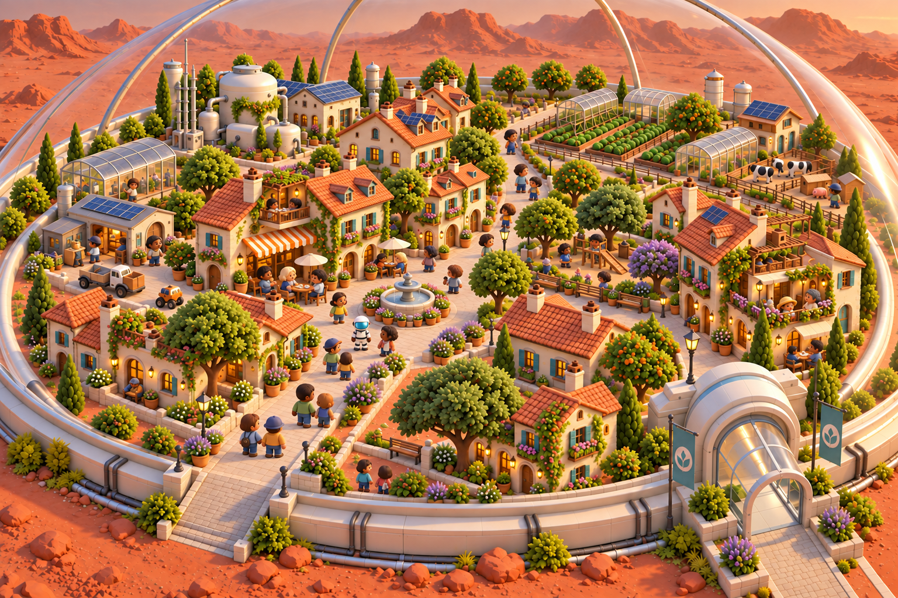

# Approved city-builder visual direction

Owner selected this concept on October 2, 2026: **“This is the one.”**

The town uses warm European-inspired architecture inside a transparent Martian habitat, smooth matte surfaces, softened forms and simplified clustered foliage. Colonists share the existing marine MC’s larger heads, compact bodies, sturdy limbs and substantial hands/feet. Doorways and furnishings are slightly chunkier; the village retains its architectural detail and dimensional lighting.

This is the visual target for the [town art style guide](../../V2_TOWN_ART_STYLE.md). It supersedes the finer, more realistic textures and human proportions of the [initial progression gallery](../v2-town-levels/README.md).

Generated concept art using the built-in image-generation tool, with the preceding town variation as the environment target and a render of the actual marine GLB as the character-proportion reference. The exact prompt and source paths are retained in [generation.json](generation.json).

Approval covers the visual direction pictured here. A generated illustration is not a usable 3D asset or in-engine capture. Individual building levels, the modular asset kit, both-camera reference scene and device/render budgets still require validation under #49. This selection does not change gameplay progression or authorize unreviewed appearances across the full catalog.
