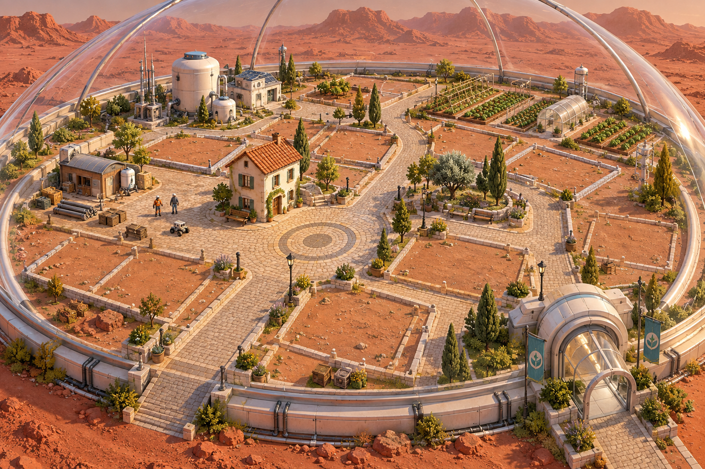
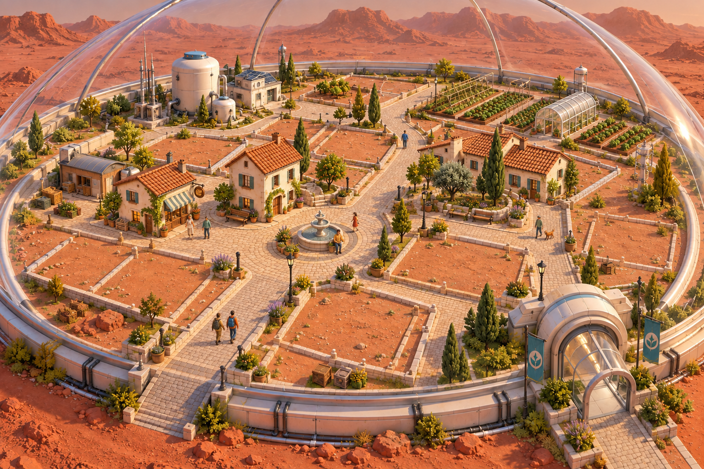
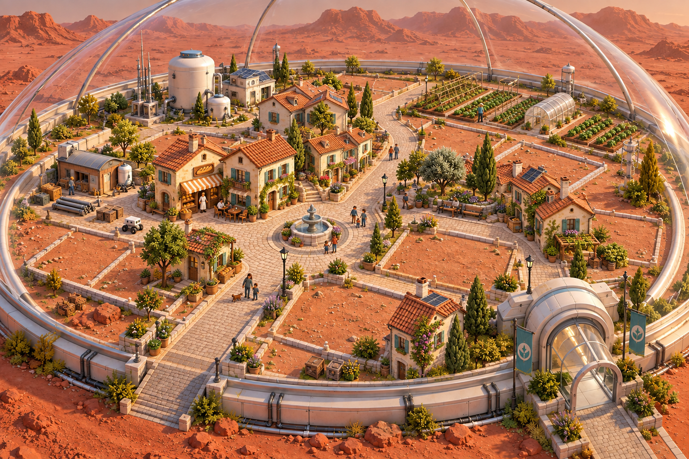
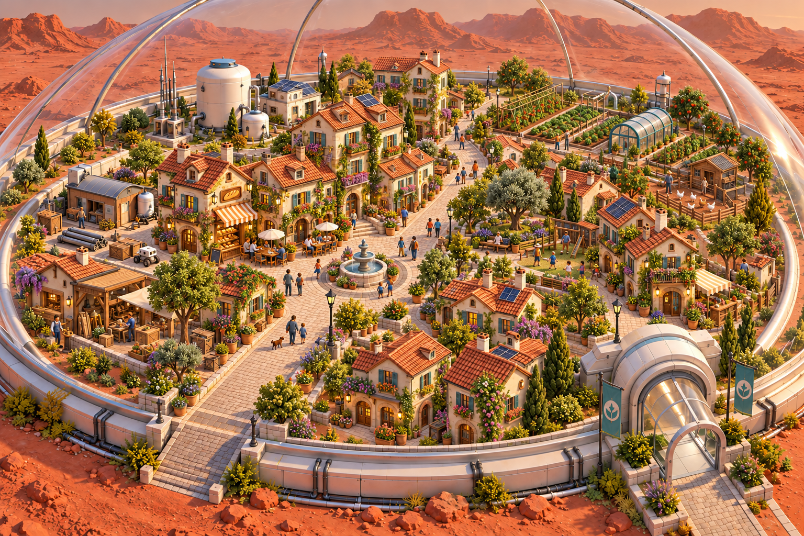
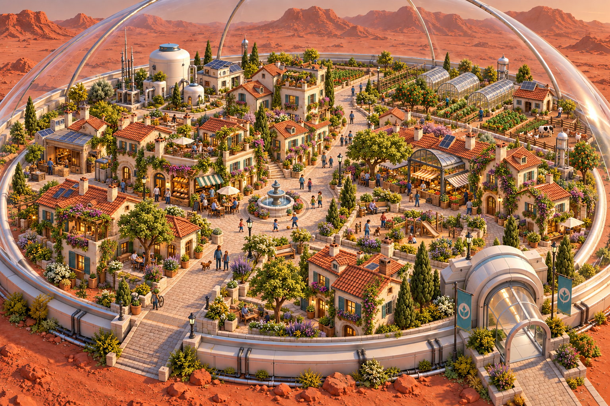
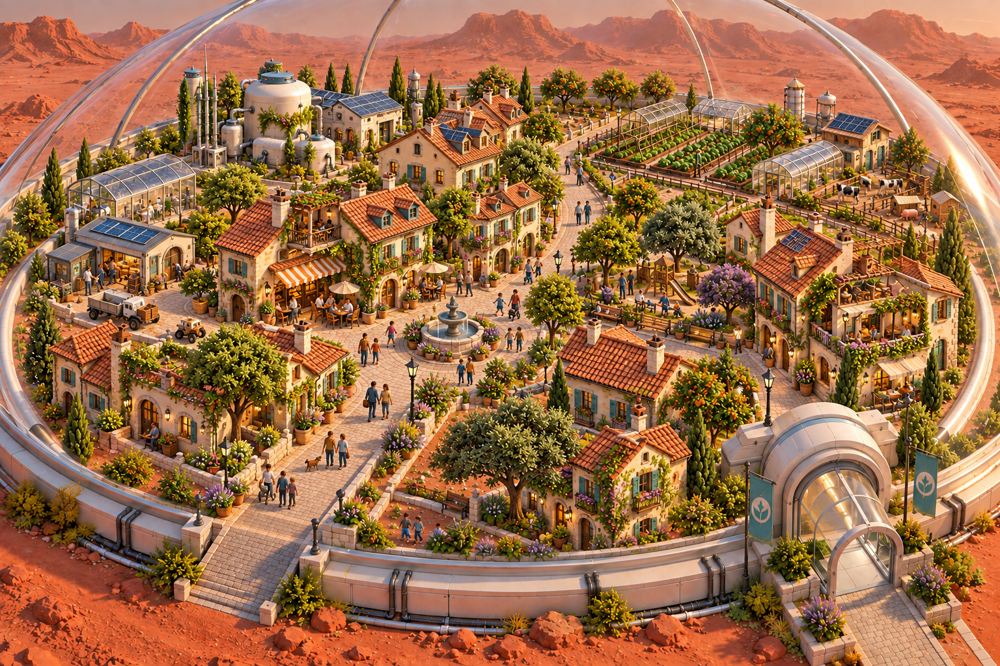

# Town development concepts — Levels 0–5

Generated October 1, 2026 with the built-in image-generation tool, using the [proposed town art style](../../V2_TOWN_ART_STYLE.md). Original AI-generated concept imagery, retained here with exact prompts and generation-file provenance in [generation.json](generation.json).

These are visual development stages of the **whole town**, with Level 0 representing a founding settlement. The accepted gameplay specifies building levels 1–5; these concepts do not add a town-level progression system or Level 0 building mechanics. Cameras, streets, habitat boundary, fountain location and lighting are held approximately consistent for comparison. Generated illustrations can vary individual details; they are not exact models or an implementation plan.

| Concept | Development emphasis |
|---|---|
| Level 0 | Founding House, installed habitat infrastructure, established paths and mostly empty plots |
| Level 1 | First homes/shop, simple fountain, modest farming and a few residents |
| Level 2 | Connected houses, Café/Bakery frontages, improved House details and productive gardens |
| Level 3 | Fuller village blocks, apartment housing, market, planted courtyard, Playground and rural livestock |
| Level 4 | Developed plots, mature planting, refined façades, stronger utilities and farm facilities |
| Level 5 | Mature compact town with signature architecture, rich civic spaces and advanced integrated equipment |

## Level 0

## Level 1

## Level 2

## Level 3

## Level 4

## Level 5

These images are for art-direction discussion. They are not usable 3D assets, in-engine captures, a finished asset kit, or owner-approved production art. Ticket #49's runnable reference corner, measurements and explicit approval remain outstanding. The pictured architecture, planting and equipment are visual proposals; their presence does not imply new production rules or implemented features.
